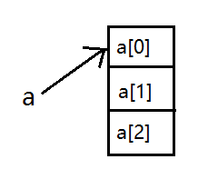
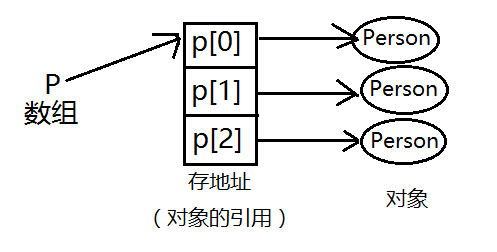

# 5.1数组(Array)

* 编译器不允许指定数组的大小（因为引用），必须用初始化表达式来初始化数组并连接到这个引用。

### 一、一维数组
* 1、概念：相同类型数据的集合九叫做数组

* 2、定义数组：`type[] 变量名 = new type[数组中元素的个数] `

  >定义长度为10的数组
  
      int[] a = new int[10]; 
      int a[] = new int[10];
  
  * 数组中元素的索引是从0开始的。对于数组来说，最大的索引等于数组的长度减一。
  
* 3、数组初始化：

  * 1>`type[] 变量名 = new type[]{逗号分隔的初始化列表}`
  
    >eg
   
        int[] b = new int[]{1,2,3,4};
  
  * 2>`type[] 变量名 = {逗号分隔的初始化列表}`
  
    >eg
     
         int[] b = {1,2,3,4};

  * 3>如果数组中的元素不是基本数据类型，那么这些元素必须被`new`。
  
    ```java
    Integer[] a = new Integer[6];
    for(int i=0;i<a.lenth;i++){// length 只读
    	a[i] = new Integer(i);
    }
	
	另一种形式
	
    Integer[] a = new Integer[]{   或Integer[] a = {
    	new Integer(1),
    	new Integer(2),
    	new Integer(3), // 这个逗号可选
    };
    
    	或
    
    Integer[] a = {
    	new Integer(1),
    	new Integer(2),
    	new Integer(3), // 这个逗号可选
    };
    ```


* 4、length属性：java中每个数组都有一个名为length的属性，表示数组的长度。

  * length属性是public、final、int的。
  
  * 数组长度一旦确定，就不能改变大小。
 
* 5、数组具有默认初始值：

      int[] a = new int[5];
      boolean[] b = new boolean[5];
      System.out.println(a[0]);//输出：0
      System.out.println(b[0]);//输出：false
 
 * 6、`int[] a = new int[3];`其中a是一个引用，它指向了生成的数组对象的首地址，数组中每个元素都是int类型，其中仅存放数据值本身。
 
      <div align="center"></div>
 
       int[] a = {1,2,3};
       int[] b = {1,2,3};
       System.out.println(a.equals(b));
 
      * `System.out.println(a.equals(b));`输出为false，因为equals()方法并未重写，仍是Object类中的equals()方法，所以比较a、b数组的首地址不同，故返回false。
      
      * `Person[] p = new Person[3];`
 
           <div align="center"></div>
 

             Person[] p = new Person[3];
             p[0] = new Person(10);
             p[1] = new Person(20);
             p[2] = new Person(30);
          
### 二、二维数组

* 1、定义：二维数组是一种平面的二维结构，本质上是数组的数组。

* 2、定义二维数组：

      type[][] a = new type[2][3];
      type a[][] = new type[2][3];
      type []a[] = new type[2][3];
 
* 3、定义不规则数组：

     <table>
      <tr>
       <td>00</td>
       <td>01</td>
      </tr>
      <tr>
       <td>10</td>
       <td>11</td>
       <td>12</td>
      </tr>
      <tr>
       <td>20</td>
      </tr>
     </table>
 
      int[][] a = new int[3][];
      a[0] = new int[2];
      a[1] = new int[3];
      a[2] = new int[1];
 
* 4、初始化二维数组

   >eg
   
      int[][] a = new int[][]{{1,2},{3,4,5},{6}};
 
 
### 三、三维数组

* 1、定义三维数组

      type[][][] a = new type[2][3][4]; 

* 2、三维数组的使用

      int[][][] a = new int[2][3][4];
		
      System.out.println(a instanceof int[][][]);//true
      System.out.println(a[0] instanceof int[][]);//true
      System.out.println(a[0][0] instanceof int[]);//true
 
### 四、交换（swap方法） 

* 参数传递：

    * 原生数据类型：传数值
    
    * 引用类型：传地址（值）
 
* 1、原生数据类型：(调用方法后无法交换) 
 
		package com.edu.test;

		public class Swap {
			public static void swap(int a,int b) {
				int temp = a;
				a = b;
				b = temp;
			}
			public static void main(String[] args) {
				int x = 3;
				int y = 4;
				Swap.swap(x, y);
				System.out.println("x=" + x + ";y=" + y);//输出：x=3;y=4
			}
		}

* 2、引用类型：
 
		package com.edu.test;

		public class Swap {

			public static void swap(int[] i) {
				int temp = i[0];
				i[0] = i[1];
				i[1] = temp;
			}
			public static void main(String[] args) {
				int[] i = {1,2};
				swap(i);
				System.out.println("i[0]=" + i[0] + ";i[1]=" + i[1]);//输出：i[0]=2;i[1]=1
			} 
		} 
 
### 五、接口及多态在数组中的应用

	package com.edu.test;

	public class ArrayTest {
		public static void main(String[] args) {
			I[] i = new I[2];
			i[0] = new C();
			i[1] = new C();
			System.out.println("i[0]=" + i[0] + ";i[1]=" + i[1]);
			//输出：i[0]=com.edu.test.C@7852e922;i[1]=com.edu.test.C@4e25154f
			//等价于：int[] i = new I[]{new C(),new C()};
		}
	}
	interface I{

	}
	class C implements I{

	}
 
* `I[] i = new I[2];`可以生成接口类型的数组，但不可生成接口类型的实例

* `i[0] = new C();`接口类型的引用可以指向实现接口的实例
 
### 六、判断两数组内容是否一致：（与Array.equals(a,b)方法相同）

       public static boolean isEquals(int[] a,int[] b) {
		if(a == null || b == null)
			return false;
		if(a.length != b.length)
			return false;
		for(int i=0;i<a.length;i++) {
			if(a[i] != b[i])
				return false;
		}
		return true;
	}
