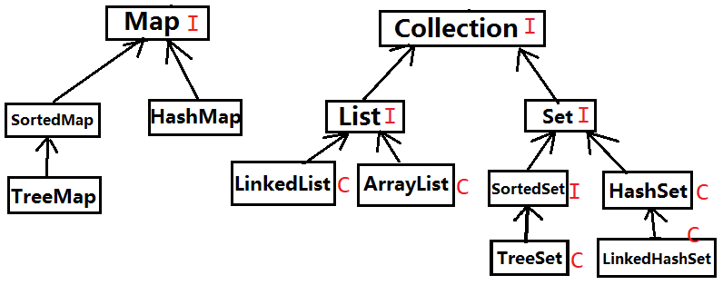
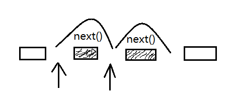

# 5.3集合简介

### 一、集合

* 集合中存放的依然是对象的引用而不是对象本身。

* 集合的结构

    

* Collection、Map、Set、List特点梳理

    *  Collection：集合层次中的根接口，JDK没 有提供这个接口直接的实现类。 
    
    * Set：**不能包含重复的元素**。SortedSet是 一个按照升序排列元素的Set。 
    
    * List：是一个有序的集合，**可以包含重复的元素**。提供了按索引访问的方式。 
    
    * Map：包含了key-value对。Map不能包含重复的key,value可以重复。SortedMap是一个按照升序排列key的Map。

### 二、通过迭代函数访问类集

* 1、使用iterator可以循环通过类集中的元素（显示每一个元素、遍历元素）

    * iterator是一个实现Iterator（或者实现 ListIterator）接口的对象。
    
    * Iterator可以完成循环通过类集，从而获得或删除元素。 
    
    * ListIterator扩展Iterator，允许双向遍历列表， 并可以修改单元。

* 2、使用迭代函数

    * 在通过迭代函数访问类集之前，必须得到一个迭 代函数。每一个Collection类都提供一个iterator( ) 函数，该函数返回一个对类集头的迭代函数。通 过使用这个迭代函数对象，可以访问类集中的每 一个元素，一次一个元素。通常，使用迭代函数 循环通过类集的内容，步骤如下 :
    
        * 1. 通过调用类集的iterator( )方法获得对类集头的迭 代函数。 
    
        * 2. 建立一个调用hasNext( )方法的循环，只要 hasNext( )返回true，就进行循环迭代。 
    
        * 3. 在循环内部，通过调用next( )方法来得到每一个元 素

* 3、通过ListIterator获得迭代函数

    * 对于执行List的类集，也可以通过调用 ListIterator 来获得迭代函数。
    
    * list迭代函数提供了前向或后向 访问类集的能力，并可让你修改元素。

* 4、迭代器工作的原理

     

