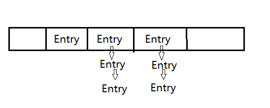

# 5.7集合总结

### 一、通过迭代函数访问类集

* 1、使用iterator可以循环通过类集中的元素（显示每一个元素、遍历元素）

    * iterator是一个实现Iterator（或者实现 ListIterator）接口的对象。
    
    * Iterator可以完成循环通过类集，从而获得或删除元素。 
    
    * ListIterator扩展Iterator，允许双向遍历列表， 并可以修改单元。

* 2、使用迭代函数

    * 在通过迭代函数访问类集之前，必须得到一个迭代函数。每一个Collection类都提供一个iterator( ) 函数，该函数返回一个对类集头的迭代函数。通过使用这个迭代函数对象，可以访问类集中的每一个元素，一次一个元素。通常，使用迭代函数循环通过类集的内容，步骤如下 :
    
        * 1. 通过调用类集的iterator( )方法获得对类集头的迭代函数。 
    
        * 2. 建立一个调用hasNext( )方法的循环，只要 hasNext( )返回true，就进行循环迭代。 
    
        * 3. 在循环内部，通过调用next( )方法来得到每一个元素

* 3、通过ListIterator获得迭代函数

    * 对于执行List的类集，也可以通过调用 ListIterator 来获得迭代函数。
    
    * list迭代函数提供了前向或后向访问类集的能力，并可让你修改元素。

* 4、迭代器工作的原理

     

### 二、HashSet与HashMap

* 1、HashSet 底层是使用 HashMap 实现的。当使用 add 方法将对象添加到 Set 当中时， 实际上是将该对象作为底层所维护的 Map 对象的 key，而 value 则都是同一个 Object 对象（该对象我们用不上）； 

* 2、HashMap 底层维护一个数组，我们向 HashMap 中所放置的对象实际上是存储在该数 组当中； 

* 3、当向 HashMap 中 put 一对键值时，它会根据 key 的 hashCode 值计算出一个位置， 该位置就是此对象准备往数组中存放的位置。 

* 4、如果该位置没有对象存在，就将此对象直接放进数组当中；如果该位置已经有对象 存在了，则顺着此存在的对象的链开始寻找（Entry 类有一个 Entry 类型的 next 成员变量，指向了该对象的下一个对象）， 如果此链上有对象的话，再去使用 equals 方法进行比较，如果对此链上的某个对象的 equals 方法比较为 false，则将该对象放到数组当中，然后将数组中该位置以前存在的那个对象链接到此对象的后面。 

* 5、HashMap 的内存实现布局： 

     

