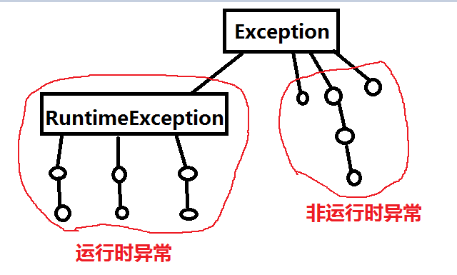

# 6.7异常(Exception)

### 一、异常（Exception）`java.lang.Exception`

* 1、Java 中的异常分为两大类： 

  *  Checked exception （非 Runtime Exception） 

  *  Unchecked exception（Runtime Exception） 

* 2、Java 中所有的异常类都会直接或间接地继承自 Exception。 

* 3、运行时异常（Runtime Exception）

  *  RuntimeException 类也是直接继承自 Exception 类；
  
  * Java 中所有的运行时异常都会直接或间接地继承自 RuntimeException 类。 

* 4、非运行时异常

  *  Java 中凡是继承自 Exception 而不是继承自 RuntimeException 的类都是非运行时异常。
  
  
    <div align="center"></div>

### 二、异常处理

* 1、异常处理的一般结构是： 

  * 无论程序是否出现异常，finally 块中的代码都是会被执行的。 

  * try...catch
    ```java
    try { 

    } catch(Exception e) { 

    }
    ```
    
  * try...catch...finally
    ```java
    try { 

    } catch(Exception e) { 

    } finally { 

    }
    ```
  
  * try...finally
    ```java
    try { 

    } finally { 

    }
    ```

* 2、对于非运行时异常（checked exception），必须要对其进行处理，处理方式有两种： 

   * 第一种是使用 try.. catch…finally 进行捕获；

   * 第二种是在调用该会产生异常的方法所在 的方法声明 throws Exception     

* 3、对于运行时异常（runtime exception），我们可以不对其进行处理，也可以对其进行处理。推荐不对其进行处理。 

* 4、NullPointerException 是空指针异常，出现该异常的原因在于某个引用为 null，但你却调用了它的某个方法。这时就会出现该异常。 

### 三、自定义异常

* 1、所谓自定义异常，通常就是定义了一个继承自 Exception 类的子类，那么这个类就是一个自定义异常类。通常情况下，我们都会直接继承自 Exception 类，一般不会继承某个运行时的异常类。 

   * 构造方法：
     ```java
     super();
     super(String str);
     ```

### 四、异常总结

* 1、使用多个 catch 块来捕获异常，这时需要将父类型的 catch 块放到子类型的 catch 块之后，这样才能保证后续的 catch 可能被执行，否则子类型的 catch 将永远无法到达，Java 编译器会报编译错误；如果多个 catch 块的异常类型是独立的 (MyException, MyException2)， 那么谁前谁后都是可以的。 

* 2、如果 try 块中存在 return 语句，那么首先也需要将 finally 块中的代码执行完毕，然后方法再返回。 

* 3、如果 try 块中存在 `System.exit(0)` 语句，那么就不会执行 finally 块中的代码，因为 `System.exit(0)`会终止当前运行的 Java 虚拟机，程序会在虚拟机终止前结束执行。


