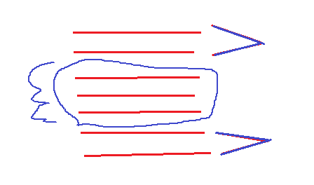

# 9.2线程

### 一、线程

* 1、Java 中如果我们自己没有产生线程，那么系统就会给我们产生一个线程（主线程， main 方法就在主线程上运行），我们的程序都是由线程来执行的。 

* 2、进程：执行中的程序（程序是静态的概念，进程是动态的概念）。 

* 3、线程的实现有两种方式：

    * 第一种方式是继承 Thread 类，然后重写 run 方法；

    * 第二种 是实现 Runnable 接口，然后实现其 run 方法。 

* 4、将我们希望线程执行的代码放到 run 方法中，然后通过 start 方法来启动线程，**start 方法首先为线程的执行准备好系统资源，然后再去调用 run 方法**。当某个类继承了 Thread 类之后，该类就叫做一个线程类。 

* 5、一个进程至少要包含一个线程。 

* 6、对于单核 CPU 来说，某一时刻只能有一个线程在执行（微观串行），从宏观角度来 看，多个线程在同时执行（宏观并行） 。

* 7、对于双核或双核以上的 CPU 来说，可以真正做到微观并行。 

* 8、线程

    * 1>Thread 类也实现了 Runnable 接口，因此实现了 Runnable 接口中的 run 方法； 

    * 2>当生成一个线程对象时，如果没有为其设定名字，那么线程对象的名字将使用如下 形式：Thread-number,该 number 将是自动增加的，并被所有的 Thread 对象所共享 （因为它是 static 的成员变量）。 

    * 3>当使用第一种方式来生成线程对象时，我们需要重写 run 方法，因为 Thread 类的 run 方法此时什么事情也不做。 

    * 4>当使用第二种方式来生成线程对象时，我们需要实现 Runnable 接口的 run 方法，然 后使用 new Thread(new MyThread())（假如 MyThread 已经实现了 Runnable 接口）来生成线程对象，这时的线程对象的 run 方法就会调用 MyThread 类的 run 方法，这样 我们自己编写的 run 方法就执行了。 

* 9、局部变量与成员变量

    * 如果一个变量是成员变量，那么多个线程对同一个对象 的成员变量进行操作时，他们对该成员变量是彼此影响的（也就是说一个线程对成 员变量的改变会影响到另一个线程） 。 
    
    * 如果一个变量是局部变量，那么每个线程都会有一个该局部变量的拷贝，一个线程对该局部变量的改变不会影响到其他的线程。 

* 10、停止线程的方式：

    * 不能使用 Thread 类的 stop 方法来终止线程的执行。一般要设定一 个变量，在 run 方法中是一个循环，循环每次检查该变量，如果满足条件则继续执 行，否则跳出循环，线程结束。 

* 11、不能依靠线程的优先级来决定线程的执行顺序。

* 12、synchronized 关键字：

    * 1>当 synchronized 关键字修饰一个方法的时候，该方法叫做同步 方法。 
    
    * 2>Java 中的每个对象都有一个锁（lock）或者叫做监视器（monitor），当访问某个对 象的 synchronized 方法时，表示**将该对象上锁**，此时其他任何线程都无法再去访问 该 synchronized 方法了，直到之前的**那个线程执行方法完毕后（或者是抛出了异常）** ， 那么将该对象的锁释放掉，其他线程才有可能再去访问该 synchronized 方法。 
    
    * 3>如果一个对象有多个 synchronized 方法，某一时刻某个线程已经进入到了某个 synchronized 方法，那么在该方法没有执行完毕前，其他线程是无法访问该对象的任 何 synchronized 方法的。 

* 13、如果某个 synchronized 方法是 static 的，那么当线程访问该方法时，它锁的并不是 synchronized 方法所在的对象，**而是 synchronized 方法所在的对象所对应的 Class 对象，因为 Java 中无论一个类有多少个对象**，这些对象会对应唯一一个 Class 对象， 因此当线程分别访问同一个类的两个对象的两个 static，synchronized 方法时，他们的执行顺序也是顺序的，也就是说一个线程先去执行方法，执行完毕后另一个线程才开始执行。 

* 14、synchronized 块，写法： 

      synchronized(object) {

      } 

    * 表示线程在执行的时候会对 object 对象上锁。 

* 15、synchronized 方法是一种粗粒度的并发控制，某一时刻，只能有一个线程执行该 synchronized 方法;synchronized 块则是一种细粒度的并发控制，只会将块中的代码同 步，位于方法内、synchronized 块之外的代码是可以被多个线程同时访问到的。 

     <div align="center"></div>

* 16、死锁（deadlock） 

* 17、wait 与 notify 方法都是定义在 Object 类中，而且是 final 的，因此会被所有的 Java 类所继承并且无法重写。这两个方法要求在调用时线程应该已经获得了对象的锁， 因此对这两个方法的调用需要放在 synchronized 方法或块当中。**当线程执行了 wait 方法时，它会释放掉对象的锁**。 

* 18、另一个会导致线程暂停的方法就是 Thread 类的 sleep 方法，它会导致线程睡眠指定 的毫秒数，但线程在睡眠的过程中是不会释放掉对象的锁的。 


### 二、线程的四种实现

* 1、继承Thread类
  ```java
  package com.edu.testjava.thread;

   /**
    * @Author: 王仁洪
    * @Date: 2018/12/11 22:03
    */
   public class Demo {
       public static void main(String[] args) {
           MyThread thread = new MyThread();
           thread.start();

           for (int i=0;i<10;i++){
               System.out.println("MainThread:" + i);
           }
       }
   }
   class MyThread extends Thread{
       @Override
       public void run() {
           for (int i=0;i<10;i++){
               System.out.println("MyThread:" + i);
           }
       }
   }
  ```

* 2、实现Runnable接口

  ```java
  package com.edu.testjava.thread;

   import java.util.concurrent.Callable;
   import java.util.concurrent.FutureTask;

   /**
    * @Author: 王仁洪
    * @Date: 2018/12/11 22:03
    */
   public class Demo {
       public static void main(String[] args) {
       
           MyThreadRunnable runnable = new MyThreadRunnable();
           Thread thread1 = new Thread(runnable);
           
           Thread thread2 = new Thread(new Runnable() {
               @Override
               public void run() {
                   for (int i=0;i<10;i++){
                       System.out.println("thread2:" + i);
                   }
               }
           });


           thread1.start();
           thread2.start();
           for (int i=0;i<10;i++){
               System.out.println("MainThread:" + i);
           }
       }
   }
   class MyThreadRunnable implements Runnable{
       @Override
       public void run() {
           for (int i=0;i<10;i++){
               System.out.println("MyThreadRunnable:" + i);
           }
       }
   }
  ```

* 3、实现Callable接口，通过FutureTask包装器来创建Thread线程
  ```java
  package com.edu.testjava.thread;

   import java.util.concurrent.Callable;
   import java.util.concurrent.FutureTask;

   /**
    * @Author: 王仁洪
    * @Date: 2018/12/11 22:03
    */
   public class Demo {
       public static void main(String[] args) {
       
           MyCallable callable = new MyCallable();
           FutureTask futureTask = new FutureTask(callable);
           Thread thread = new Thread(futureTask);
           thread.start();
           
           for (int i=0;i<10;i++){
               System.out.println("MainThread:" + i);
           }
       }
   }
   class MyCallable implements Callable{

       @Override
       public Object call() throws Exception {
           for (int i=0;i<10;i++){
               System.out.println("MyCallable:" + i);
           }
           return null;
       }
   }
  ```


