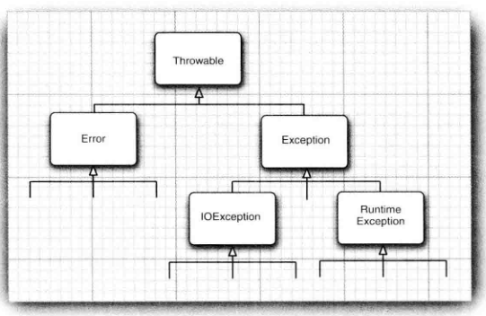

<div align=center><h1>6.5 代理</h1></div>

* 1、由于程序的错误或一些外部环境的影响造成用户数据的丢失了避免这类事情的发生，至少应该做到以下几点：
	* 向用户通告错误；
	* 保存所有的工作结果；
	* 允许用户以妥善的形式退出程序。
* 2、对于异常情况，例如，可能造成程序崩溃的错误输入，Java使用一种称为异常处理(exception handing) 的错误捕获机制处理。Java中的异常处理与 C++ 或 Delphi 中的异常处理十分类似。
* 3、在测试期间，需要进行大量的检测以验证程序操作的正确性。然而，这些检测可能非常耗时，在测试完成后也不必保留它们，因此，可以将这些检测删掉，并在其他测试需要时将它们粘贴回来，这是一件很乏味的事情。——**断言**
* 4、当程序出现错误时，并不总是能够与用户或终端进行沟通。此时，可能希望记录下出现的问题，以备日后进行分析。——**日志**
* 5、假设在一个 Java程序运行期间出现了一个错误。这个错误可能是由于文件包含了错误信息，或者网络连接出现问题造成的，也有可能是因为使用无效的数组下标，或者试图使用一个没有被赋值的对象引用而造成的。用户期望在出现错误时，程序能够采用一些理智的行为。
* 6、如果由于出现错误而使得某些操作没有完成，程序应该：
	* 返回到一种安全状态，并能够让用户执行一些其他的命令；或者
	* 允许用户保存所有操作的结果，并以妥善的方式终止程序。


### 7.1.1 异常分类

* 1、在 Java程序设计语言中，异常对象都是派生于 Throwable类的一个实例。

  <div align="center"></div>

* 2、需要注意的是，所有的异常都是由 Throwable 继承而来，但在下一层立即分解为两个分支：Error 和 Exception。
* 3、Error类层次结构描述了 Java运行时系统的内部错误和资源耗尽错误。应用程序不应该抛出这种类型的对象。如果出现了这样的内部错误，除了通告给用户，并尽力使程序安全地终止之外，再也无能为力了。这种情况很少出现。
* 4、在设计 Java 程序时，需要关注 Exception 层次结构。这个层次结构又分解为两个分支：一个分支派生于 RuntimeException ; 另一个分支包含其他异常。
* 5、划分两个分支的规则是：由程序错误导致的异常属于 RuntimeException ; 而程序本身没有问题，但由于像 I/O 错误这类问题导致的异常属于其他异常:
* 6、派生于 RuntimeException 的异常包含下面几种情况：	
	* 错误的类型转换。
	* 数组访问越界
	* 访问 null 指针
* 7、不是派生于 RuntimeException 的异常包括：
	* 试图在文件尾部后面读取数据。
	* 试图打开一个不存在的文件。
	* 试图根据给定的字符串查找 Class对象，而这个字符串表示的类并不存在。
* 8、“如果出现 RuntimeException 异常，那么就一定是你的问题”是一条相当有道理的规则。
* 9、应该通过检测数组下标是否越界来避免 **ArraylndexOutOfBoundsException 异常**；应该通过在使用变量之前检测是否为 null 来杜绝 **NullPointerException 异常**的发生：
* 10、Java语言规范将派生于 Error类 或 RuntimeException类的所有异常称为**非受查(unchecked) 异常**，所有其他的异常称为**受查（checked) 异常**。

### 7.1.2 声明受查异常

* 1、一个方法不仅需要告诉编译器将要返回什么值，还要告诉编译器有可能发生什么错误。
* 2、在自己编写方法时，不必将所有可能抛出的异常都进行声明。至于什么时候需要在方法中用 throws子句声明异常，什么异常必须使用 throws子句声明，需要记住在遇到下面 4 种情况时应该抛出异常：
	* 1)调用一个抛出受査异常的方法，例如，FilelnputStream构造器。
	* 2)程序运行过程中发现错误，并且利用 throw语句抛出一个受查异常。
	* 3)程序出现错误，例如，`a[-l]=0`会抛出一个 ArraylndexOutOffloundsException这样的非受查异常。
	* 4)Java虚拟机和运行时库出现的内部错误。
	* 如果出现前两种情况之一，则必须告诉调用这个方法的程序员有可能抛出异常。为什么？ 因为任何一个抛出异常的方法都有可能是一个死亡陷阱。如果没有处理器捕获这个异常，当前执行的线程就会结束。
* 3、对于那些可能被他人使用的 Java方法，应该根据异常规范（exception specification), 在
方法的首部声明这个方法可能抛出的异常。
  ```java
  class MyAnimation{
      public Image loadlmage(String s) throws IOException{
           .............
      }
  }
  ```
* 4、如果一个方法有可能抛出多个受查异常类型，那么就必须在方法的首部列出所有的异常类。每个异常类之间用逗号隔开。如下面这个例子所示：
  ```java
  class MyAnimation{
      public Image loadlmage(String s) throws FileNotFoundException, EOFException{
            ......
      }
  }
  ```
* 5、不需要声明 Java的内部错误，即从 Error继承的错误。任何程序代码都具有抛出那些异常的潜能，而我们对其没有任何控制能力。
* 6、不应该声明从 RuntimeException继承的那些非受查异常。
  ```java
  class MyAnimation{
      void drawlmage(inti) throws ArraylndexOutOfBoundsException{// bad style
          ........ 
     }
  }
  ```
* 7、一个方法必须声明所有可能抛出的受查异常，而非受查异常要么**不可控制（Error)**,要么就应该**避免发生（RuntimeException**)。
* 8、如果方法没有声明所有可能发生的受查异常，编译器就会发出一个错误消息。
* 9、除了**声明异常**之外，还可以**捕获异常**。这样会使异常不被抛到方法之外，也不需要 throws规范。
* 10、如果在子类中覆盖了超类的一个方法，
	* **子类方法中声明的受查异常不能比超类方法中声明的异常更通用**（也就是说，子类方法中可以抛出更特定的异常，或者根本不抛出任何异常）。
	* **如果超类方法没有抛出任何受查异常，子类也不能抛出任何受查异常**。例如，如果覆盖 JComponent.paintComponent方法，由于超类中这个方法没有抛出任何异常，所以，自定义的 paintComponent 也不能抛出任何受查异常。
* 11、如果类中的一个方法声明将会抛出一个异常，而这个异常是某个特定类的实例时，则这个方法就有可能抛出一个这个类的异常，或者这个类的任意一个子类的异常。例如，FilelnputStream构造器声明将有可能抛出一个 IOExcetion异常，然而并不知道具体是哪种 IOException异常。它既可能是 IOException异常，也可能是其子类的异常，例如，FileNotFoundException。


### 7.1.3 如何抛出异常

* 1、下面是抛出这个异常的语句：
  ```java
  throw new EOFException();
  或者
  EOFException e = new EOFException();
  throw e;
  下面将这些代码放在一起：
  String readData(Scanner in) throws EOFException{
     while (…）{
         if (Mn.hasNext()){ // EOF encountered
             if (n < len)
                throw new EOFException();
          }
     }
     return s;
  }
  ```

* 2、EOFException 类还有一个含有一个字符串型参数的构造器。这个构造器可以更加细致的描述异常出现的情况。
  ```java
  String gripe = "Content-length: " +len+ ", Received: " + n;
  throw new EOFException(gripe);
  ```
* 3、对于一个已经存在的异常类，将其抛出非常容易D 在这种情况下：
	* 1)找到一个合适的异常类。
	* 2)创建这个类的一个对象。
	* 3)将对象抛出。
	* 一旦方法抛出了异常，这个方法就不可能返回到调用者。也就是说，不必为返回的默认值或错误代码担忧。
* 4、抛出异常的过程，在Java 中，只能抛出 Throwable 子类的对象。

### 7.1.4 创建异常类

* 1、在程序中，可能会遇到任何标准异常类都没有能够充分地描述清楚的问题。在这种情况下，创建自己的异常类就是一件顺理成章的事情了。我们需要做的只是定义一个派生于Exception 的类，或者派生于Exception 子类的类。
* 2、例如，定义一个派生于 IOException 的类。习惯上，定义的类应该包含两个构造器，一个是默认的构造器；另一个是带有详细描述信息的构造器（超类 Throwable 的 toString 方法将会打印出这些详细信息，这在调试中非常有用)。
  ```java
  package com.edu.exception;

  import java.io.BufferedReader;
  import java.io.IOException;

  /**
   * @Author: 王仁洪
   * @Date: 2019/3/22 15:46
   */
  public class FileFormatException extends IOException {
    public FileFormatException(){

    }

    public FileFormatException(String gripe){
        super(gripe);
    }
  }
  ```
	* 现在，就可以抛出自己定义的异常类型了。
	  ```java
	  class TestException{
	      public String (BufferedReader in) throws FileFormatException{
          ...
          while (...){
             if (ch == -1) {//EOF encountered
                if (n < len){
                    if (n < len)    
                        throw new FileFornatException();
                }
            }
            return s; 
         }
	  }
	  ```