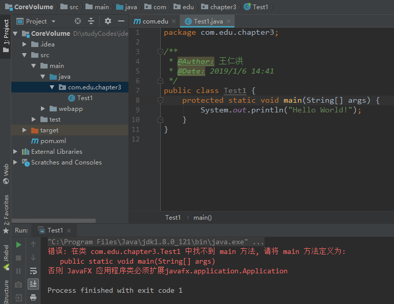

<h1 align="center">3.1 一个简单的JAVA应用程序</h1>

```java
public class Test1 {
    public static void main(String[] args) {
        System.out.println("Hello World!");
    }
}
```

* 首先，Java 区分大小写。如果出现了大小写拼写错误（例如，将 main拼写成 Main),程序将无法运行。
* public：关键字 public称为访问修饰符（accessmodifier), 这些修饰符用于控制程序的其他部分对这段代码的访问级別。
* class：关键字 class表明 Java程序中的全部内容都包含在类中。这里，只需要将类作为一个加载程序逻辑的容器，程序逻辑定义了应用程序的行为。**类是构建所有 Java应用程序和 applet 的构建块。Java应用程序中的全部内容都必须放置在类中。**
* Test1：关键字 class后面紧跟**类名**`Test1`。
  * 类名命名：Java中定义类名的规则很宽松。名字必须以字母开头，后面可以跟字母和数字的任意组合。长度基本上没有限制。但是不能使用 Java保留字（例如，public或 class) 作为类名。
  * 类名规范之胳蛇命名法：类名是以大写字母开头的名词。如果名字由多个单词组成，每个单词的第一个字母都应该大写。eg:Test1
  * 源代码的文件名必须与公共类的名字相同，并用`.java`作为扩展名。因此，存储这段源代码的文件名必须为 `Test1.java`(大小写是非常重要的，千万不能写成 `test1.java`)
* `main(String[] args)`：为了代码能够执行，在类的源文件中必须包含一个 main方法。
  * 根据 Java语言规范，main方法必须声明为 public( Java语言规范是描述 Java语言的官方文档。)
  * 不过，当 main 方法不是public时，有些版本的 Java解释器也可以执行 Java应用程序。在 JavaSE 1.4及以后的版本中强制 main方法是 public的。

	<div align="center"></div>
* 
