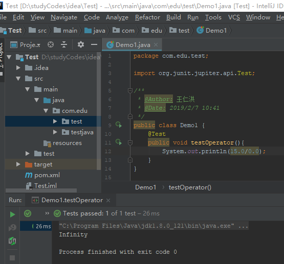
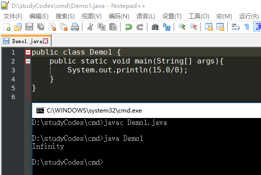

<div align=center><h1>JAVA基础语法</h1></div>

* 1、在 Java 中，不区分变量的声明与定义。</br>
  C++ 注释：C 和 C++区分变量的声明与定义。例如：
  ```java
  int i = 10;是一个定义，而
  extern int i;是一个声明。
  在 Java 中，不区分变量的声明与定义。
  ```


* 2、const是Java 保留的关键字，但目前并没有使用。在 Java 中，必须使用 final定义常量。
* 3、整数被 0 除将会产生一个异常，而浮点数被 0 除将会得到无穷大或 NaN 结果。

   <div align=center></div>
   <div align=center></div>

* 4、整数余数的问题
  ```java
  System.out.println(-12%5);//-2
  System.out.println(12%-5);//2
  ```

* 5、当使用两个数值进行二元操作时（例如 n+f，n 是整数，f 是浮点数)，先要将两个操作数转换为同一种类型，然后再进行计算。
	* 如果两个操作数中有一个是double 类型，另一个操作数就会转换为double 类型。
	* 否则，如果其中一个操作数是 float 类型，另一个操作数将会转换为 float 类型。
	* 否则，如果其中一个操作数是 long 类型，另一个操作数将会转换为 long 类型。
	* 否则，两个操作数都将被转换为 int 类型。


* 6、强制类型转换
	* 强制类型转换通过截断小数部分将浮点值转换为整型。
	* 如果想对浮点数进行舍人运算，以便得到最接近的整数（在很多情况下，这种操作更有用)，那就需要使用 Math_round 方法：
	  ```java
	  double xz 9.997;
	  int nx = (int) Math.round(x);
	  ```

		* 现在，变量 nx 的值为 10。当调用 round 的时候，仍然需要使用强制类型转换（int)。其原因是 round方法返回的结果为 long 类型，由于存在信息丢失的可能性，所以只有使用显式的强制类型转换才能够将 long类型转换成 int 类型。
	* 如果试图将一个数值从一种类型强制转换为另一种类型，而又超出了目标类型的表示范围，结果就会截断成一个完全不同的值。例如，（byte) 300 的实际值为 44。
	* 不要在 boolean 类型与任何数值类型之间进行强制类型转换，这样可以防止发生错误。只有极少数的情况才需要将布尔类型转换为数值类型，这时可以使用条件表达式 `b? 1:0`。
* 7、`>>>`运算符会用 0 填充高位，这与`>>`不同，它会用符号位填充高位。不存在`<<<`运算符。
* 8、如果需要把多个字符串放在一起，用一个定界符分隔，可以使用静态join方法：
  ```java
  String all = String.join("/","S","M","L","XL");
  all的结果是：S/M/L/XL
  ```

* 9、由于不能修改 Java字符串中的字符，所以在 Java文档中将 **String 类对象称为不可变字符串**，如同数字 3 永远是数字 3 —样，字符串“Hello”永远包含字符 H、e、l、l 和 o 的代码单元序列，而不能修改其中的任何一个字符。当然，可以修改字符串变量 greeting，让它引用另外一个字符串，这就如同可以将存放 3的数值变量改成存放 4 一样。//`String greeting = "hello"`
* 10、各种字符串存放在**公共的存储池**中。字符串变量指向存储池中相应的位置。如果复制一个字符串变量，原始字符串与复制的字符串共享相同的字符。
* 11、一定不要使用`==`运算符检测两个字符串是否相等。这个运算符只能够确定两个字串是否放置在同一个位置上。当然，如果字符串放置在同一个位置上，它们必然相等。但是，完全有可能将内容相同的多个字符串的拷贝放置在不同的位置上。
* 12、空串与 Null 串
	* 空串`""`是长度为 0 的字符串。可以调用以下代码检查一个字符串是否为空：
	  ```java
	  if (str.lengthQ = 0)
	  或
	  if (str.equals(""))
	  ```
	* 空串是一个 Java对象，有自己的串长度（0) 和内容（空）。不过，String 变量还可以**存放一个特殊的值，名。要检查一个字符串是否为 null, 要使用以下条件：
	  ```java
	  if (str == null)
	  ```
	* 有时要检查一个字符串既不是 null 也不为空串，这种情况下就需要使用以下条件：
	  ```java
	  if (str != null && str.lengthO != 0)
	  ```
		* 首先要检查 str 不为 null。如果在一个mill值上调用方法，会出现错误。
* 13、Java 字符串由 char 值序列组成。“char 类型”已经看到，char 数据类型是一个采用 UTF-16编码表示 Unicode码点的代码单元。大多数的常用 Unicode字符使用一个代码单元就可以表示，而辅助字符需要一对代码单元表示。
* 14、所有字符串都属于`CharSequence `接口。
* 15、由较短的字符串构建字符串时，用字符串连接的方式达到此目的效率比较低。每次连接字符串，都会构建一个新的 String 对象，既耗时，又浪费空间。使用 StringBuildei•类就可以避免这个问题的发生。
  ```java
  首先，构建一个空的字符串构建器：
  StringBuilder builder = new StringBuilder();
  当每次需要添加一部分内容时，就调用 append 方法。
  builder.append(ch); //appends a single character
  bui1der.append(str); //appends a string
  在需要构建字符串时就凋用 toString方法，将可以得到一个 String 对象，其中包含了构建器中的字符序列。
  String completedString = builder.toString();
  ```
* 16、StringBuilder 类的前身是 StringBuffer, 其效率稍有些低，但允许采用多线程的方式执行添加或删除字符的操作。如果所有字符串在一个单线程中编辑 （通常都是这样)，则应该 StringBuilder 替代它。这两个类的 API 是相同的。
* 17、要想对文件进行读取，就需要一个用 File 对象构造一个 Scanner对象，如下所示：
  ```java
  Scanner in = new Scanner(Paths.get("niyflle.txt"), "UTF-8");
  ```
* 18、要想写入文件，就需要构造一个 PrintWriter对象。在构造器中，只需要提供文件名：  
  ```java
  PrintWriter out = new PrintlulriterC'myfile.txt", "UTF-8");
  如果文件不存在，创建该文件。可以像输出到 System.out—样使用 print、println 以及 printf命令。
  ```
* 19、警告：可以构造一个带有字符串参数的 Scanner, 但这个 Scanner 将字符串解释为数据，
而不是文件名。例如，如果调用：
  ```java
  Scanner in = new Scannerrmyfile.txt");// ERROR?
  这个 scanner 会将参数作为包含 10 个字符的数据：‘m’，‘y’，‘f’ 等。在这个示例中所显示的并不是人们所期望的效果。
  ```
* 20、使用集成开发环境，那么启动路径将由 IDE 控制。可以使用下面的调用方式找到路径的位置：
  ```java
  String dir = System.getProperty("user.dir");
  ```
* 21、块（即复合语句）是指由一对大括号括起来的若干条简单的 Java语句。块确定了变量的作用域。一个块可以嵌套在另一个块中。
* 22、使用块 （有时称为复合语句）可以在 Java 程序结构中原本只能放置一条（简单）语句的地方放置多条语句。
* 22、尽管 Java允许在 for 循环的各个部分放置任何表达式，但有一条不成文的规则：for语句的 3个部分应该对同一个计数器变量进行初始化、检测和更新。若不遵守这一规则，编写的循环常常晦涩难懂。
* 23、使用switch语句，编译代码时可以考虑加上-Xlint:fallthrough选项，如下所示：
  ```java
  javac -Xlint:fallthrough Test.java
  ```
* 24、case标签可以是：
	* 类型为 char、byte、short 或 int 的常量表达式。
	* 枚举常量。
	* 从 JavaSE7开始，case标签还可以是字符串字面量。
* 25、break与continue
	* 不带标签的 break语句与用于退出 switch语句的 break 语句一样，它也可以用于退出循环语句。带标签的 break语句，用于跳出多重嵌套的循环语句。
	* continue 语句将控制转移到最内层循环的首部。带标签的 continue语句，将跳到与标签匹配的循环首部。
* 26、Biglnteger 和 BigDecimal 这两个类可以处理包含任意长度数字序列的数值。
	* Biglnteger 类实现了任意精度的整数运算；
		* 使用静态的 valueOf 方法可以将普通的数值转换为大数值：
		  ```java
		  Biglnteger a = Biglnteger.valueOf(100);
		  ```
		* 遗憾的是，不能使用人们熟悉的算术运算符（如：`+`和`*`) 处理大数值。而需要使用大数值类中的 `add` 和 `multiply`方法。
		  ```java
		  Biglnteger c = a.add(b); // c = a + b
		  Biglnteger d = c.nultipiy(b.add(Biglnteger.valueOf(2)));// d = c * (b + 2)
		  ```
	* BigDecimal 类实现了任意精度的浮点数运算。

  ```java
  @Test
    public void testBigInteger(){
        BigInteger bigInteger = BigInteger.valueOf(2);
        BigInteger value1 = bigInteger.add(BigInteger.valueOf(2));
        BigInteger value2 = bigInteger.multiply(value1);
        System.out.println(value1);//4
        System.out.println(value2);//8
    }

    @Test
    public void testBigDecimal(){
        System.out.println(1.2+2.4);//3.5999999999999996
        System.out.println(1.4+2.2);//3.6

        System.out.println(BigDecimal.valueOf(1.2).add(BigDecimal.valueOf(2.4)));//3.6
        System.out.println(BigDecimal.valueOf(1.4).add(BigDecimal.valueOf(2.2)));//3.6
    }
  ```

* 27、与 C++ 不同，Java没有提供运算符重载功能。程序员无法重定义 `+ 和 *` 运算符，使其应用于 BigInteger 类的 add 和 multiply 运算。Java语言的设计者确实为字符串的连接重栽了 `+` 运算符，但没有重载其他的运算符，也没有给 Java程序员在自己的类中重栽运算符的机会，
* 28、