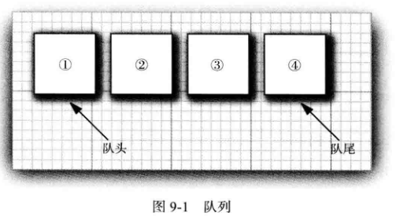
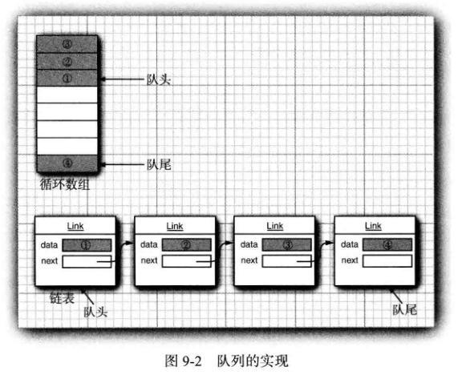
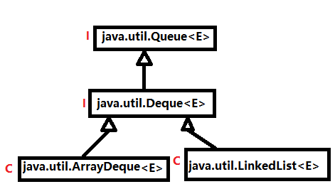
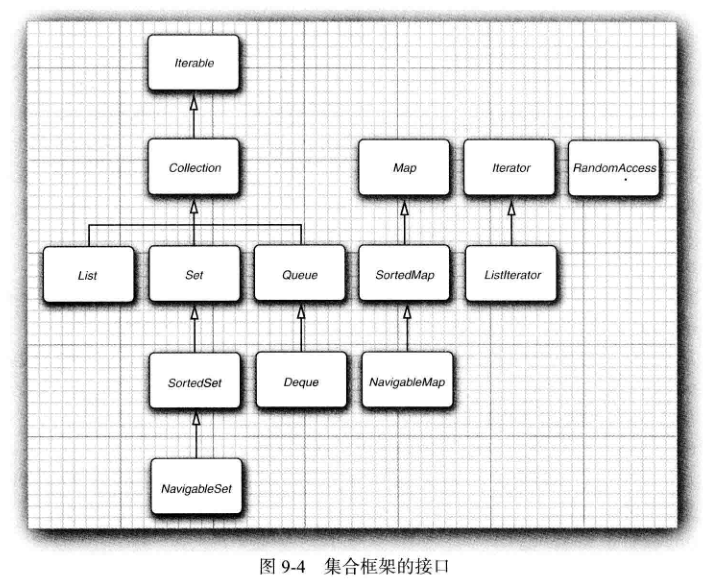

<div align=center><h1>9.1 Java集合框架</h1></div>

* Java最初版本只为最常用的数据结构提供了很少的一组类：Vector、Stack、HashtableBitSet 与 Enumeration接口，其中的 Enumeration接口提供了一种用于访问任意容器中各个元素的抽象机制。

### 9.1.1 将集合的接口与实现分离

* 1、Java集合类库将接口（ interface) 与实现(implementation) 分离。
* 2、队列接口指出可以在队列的尾部添加元素，在队列的头部删除元素，并且可以査找队列中元素的个数。
* 3、当需要收集对象，并按照“先进先出” 的规则检索对象时就应该使用队列。
  <div align="center"></div>

* 4、队列接口API
  ```java
  package java.util;
  public interface Queue<E> extends Collection<E> {
      boolean add(E e);
      boolean offer(E e);
      E remove();
      E poll();
      E element();
      E peek();
  }
  ```
* 5、这个接口并没有说明队列是如何实现的。队列通常有两种实现方式：一种是使用循环数组；另一种是使用链表（见图 9-2)。
  <div align="center"></div>

* 6、如果需要一个**循环数组队列**，就可以使用 ArrayDeque类。
* 7、如果需要一个**链表队列**，就直接使用 LinkedList类，这个类实现了 Queue接口。
  <div align="center"></div>

* 8、当在程序中使用队列时，一旦构建了集合就不需要知道究竟使用了哪种实现。因此，只有在构建集合对象时，使用具体的类才有意义。可以使用接口类型存放集合的引用。
  ```java
  Queue<Customer> expresslane = new CircularArrayQueue<>(100);
  expressLane.add(new Customer("Harry"));
  ```
	* 利用这种方式，一旦改变了想法，可以轻松地使用另外一种不同的实现。只需要对程序的一个地方做出修改，即调用构造器的地方。如果觉得 LinkedListQueue是个更好的选择，就将代码修改为：
	  ```java
	  Queue<Custoaer> expressLane = new LinkedListQueue<>();
	  expressLane.add(new Custonier('Harry"));
	  ```
* 9、为什么选择这种实现，而不选择那种实现呢？ 接口本身并不能说明哪种实现的效率究竟如何。循环数组要比链表更高效，因此多数人优先选择循环数组。然而，通常这样做也需要付出一定的代价。
* 10、循环数组是一个有界集合，即容量有限。如果程序中要收集的对象数量没有上限，就最好使用链表来实现。

### 9.1.2 Collection 接口

```java
package java.util;

import java.util.function.Predicate;
import java.util.stream.Stream;
import java.util.stream.StreamSupport;
public interface Collection<E> extends Iterable<E> {
    int size();
    boolean isEmpty();
    boolean contains(Object o);
    Iterator<E> iterator();
    Object[] toArray();
    <T> T[] toArray(T[] a);
    boolean add(E e);
    boolean remove(Object o);
    boolean containsAll(Collection<?> c);
    boolean addAll(Collection<? extends E> c);
    boolean removeAll(Collection<?> c);
    default boolean removeIf(Predicate<? super E> filter) {
        Objects.requireNonNull(filter);
        boolean removed = false;
        final Iterator<E> each = iterator();
        while (each.hasNext()) {
            if (filter.test(each.next())) {
                each.remove();
                removed = true;
            }
        }
        return removed;
    }
    boolean retainAll(Collection<?> c);
    void clear();
    boolean equals(Object o);
    int hashCode();
    @Override
    default Spliterator<E> spliterator() {
        return Spliterators.spliterator(this, 0);
    }
    default Stream<E> stream() {
        return StreamSupport.stream(spliterator(), false);
    }
    default Stream<E> parallelStream() {
        return StreamSupport.stream(spliterator(), true);
    }
}
```

* 1、在 Java类库中，集合类的基本接口是 Collection接口。这个接口有两个基本方法:
  ```java
  public interface Collection<E> {
      boolean add(E element);
      Iterator<E> iterator();
      ......
  }  
  ```
* 2、add方法用于向集合中添加元素。如果添加元素确实改变了集合就返回 true, 如果集合没有发生变化就返回 false。例如，如果试图向集中添加一个对象，而这个对象在集中已经存在，这个添加请求就没有实效，因为集中不允许有重复的对象。
* 3、iterator方法用于返回一个实现了 Iterator 接口的对象。可以使用这个迭代器对象依次访问集合中的元素。

### 9.1.3 迭代器

```java
package java.util;

import java.util.function.Consumer;
public interface Iterator<E> {
    boolean hasNext();
    E next();
    default void remove() {
        throw new UnsupportedOperationException("remove");
    }
    default void forEachRemaining(Consumer<? super E> action) {
        Objects.requireNonNull(action);
        while (hasNext())
            action.accept(next());
    }
}
```

* 1、通过反复调用 next方法，可以逐个访问集合中的每个元素。但是，如果到达了集合的末尾，next方法将抛出一个 NoSuchElementException。因此，需要在调用next 之前调用 hasNext方法。如果迭代器对象还有多个供访问的元素，这个方法就返回 true。
* 2、如果想要査看集合中的所有元素，就请求一个迭代器，并在 hasNext返回 true时反复地调用 next方法。
  ```java
  Collection<String> c = ...;
  Iterator<String> iter = c.iterator();
  while (iter.hasNext()){
      String element = iter.next()；
      dosomething with element
  }
  ```
* 3、用“foreach” 循环可以更加简练地表示同样的循环操作。编译器简单地将“foreach”循环翻译为带有迭代器的循环。
  ```java
  for (String element : c){
      dosomething with element
  }
  ```
* 4、“for each” 循环可以与任何实现了 Iterable接口的对象一起工作，这个接口只包含一个抽象方法：
  ```java
  package java.lang;

  import java.util.Iterator;
  import java.util.Objects;
  import java.util.Spliterator;
  import java.util.Spliterators;
  import java.util.function.Consumer;
  public interface Iterable<T> {
      Iterator<T> iterator();
      
       default void forEach(Consumer<? super T> action) {
          Objects.requireNonNull(action);
          for (T t : this) {
              action.accept(t);
          }
      }
      default Spliterator<T> spliterator() {
          return Spliterators.spliteratorUnknownSize(iterator(), 0);
      }
  }
  ```
* 5、Collection接口扩展了 Iterable接口。因此，对于标准类库中的任何集合都可以使用“for each” 循环。
* 6、在 Java SE 8中，甚至不用写循环。可以调用 forEachRemaining方法并提供一lambda表达式（它会处理一个元素）。将对迭代器的每一个元素调用这个 lambda表达式，直到再没有元素为止。
  ```java
  iterator.forEachRemaining(element -> dosomethingwith element);
  ```
* 7、**元素被访问的顺序取决于集合类型**。
	* 如果对 ArrayList进行迭代，迭代器将从索引 0开始，每迭代一次，索引值加 1 。 
	* 然而，如果访问 HashSet 中的元素，每个元素将会按照某种随机的次序出现。虽然可以确定在迭代过程中能够遍历到集合中的所有元素，但却无法预知元素被访问的次序。这对于计算总和或统计符合某个条件的元素个数这类与顺序无关的操作来说，并不是什么问题。
* 8、Iterator接口的 next 和 hasNext 方法与 Enumeration接口的nextElement 和hasMoreElements方法的作用一样。
* 9、**Java迭代器的查找操作与位置变更是紧密相连的。查找一个元素的唯一方法是调用 next, 而在执行查找操作的同时，迭代器的位置随之向前移动**。
* 10、应该将 Java迭代器认为是位于两个元素之间。当调用 next 时，迭代器就越过下一个元素，并返回刚刚越过的那个元素的引用（见图 9-3)D
  <div align="center"></div>

* 11、这里还有一个有用的推论。可以将丨terator.next 与 InputStream.read看作为等效的。从数据流中读取一个字节，就会自动地“ 消耗掉”这个字节。下一次调用 read将会消耗并返回输入的下一个字节。用同样的方式，反复地调用 next 就可以读取集合中所有元素。
* 12、Iterator 接口的 remove方法将会删除上次调用 next 方法时返回的元素。
* 13、在大多数情况下，在决定删除某个元素之前应该先看一下这个元素是很具有实际意义的。然而，如果想要删除指定位置上的元素，仍然需要越过这个元素。例如，下面是如何删除字符串集合中第一个元素的方法：
  ```java
  Iterator<String> it = c.iterator();
  it.next(); // skip over the first element
  it.remove(); // now remove it
  ```
* 14、更重要的是，对 next方法和 remove方法的调用具有互相依赖性。如果调用 remove之前没有调用 next 将是不合法的。如果这样做，将会抛出一个 IllegalStateException异常。
	* 如果想删除两个相邻的元素，不能直接地这样调用：
	  ```java
	  it.remove();
	  it.remove();// Error!
	  ```
	* 相反地，必须先调用 next 越过将要删除的元素。
	  ```java
	  it.remove();
	  it.next();
	  it.remove(); // OK
	  ```

### 9.1.4 泛型实用方法

* 1、**由于 Collection与 Iterator 都是泛型接口，可以编写操作任何集合类型的实用方法**。例如，下面是一个检测任意集合是否包含指定元素的泛型方法：
  ```java
  public static <E> boolean contains(Collection<E> c, Object obj) {
      for (E element : c) {
          if (element.equals(obj)) {
              return true;
          }
      }
      return false;
  }
  ```
* 2、Java类库的设计者认为：这些实用方法中的某些方法非常有用，应该将它们提供给用户使用。这样，类库的使用者就不必自己重新构建这些方法了。contains就是这样一个实用方法。
* 3、事实上，Collection接口声明了很多有用的方法，所有的实现类都必须提供这些方法。
  ```java
  package java.util;

  import java.util.function.Predicate;
  import java.util.stream.Stream;
  import java.util.stream.StreamSupport;
  public interface Collection<E> extends Iterable<E> {
      int size();
      boolean isEmpty();
      boolean contains(Object o);
      Iterator<E> iterator();
      Object[] toArray();
      <T> T[] toArray(T[] a);
      boolean add(E e);
      boolean remove(Object o);
      boolean containsAll(Collection<?> c);
      boolean addAll(Collection<? extends E> c);
      boolean removeAll(Collection<?> c);
      default boolean removeIf(Predicate<? super E> filter) {
          Objects.requireNonNull(filter);
          boolean removed = false;
          final Iterator<E> each = iterator();
          while (each.hasNext()) {
              if (filter.test(each.next())) {
                  each.remove();
                  removed = true;
              }
          }
          return removed;
      }
      boolean retainAll(Collection<?> c);
      void clear();
      boolean equals(Object o);
      int hashCode();
      @Override
      default Spliterator<E> spliterator() {
          return Spliterators.spliterator(this, 0);
      }
      default Stream<E> stream() {
          return StreamSupport.stream(spliterator(), false);
      }
      default Stream<E> parallelStream() {
          return StreamSupport.stream(spliterator(), true);
      }
  }
  ```

* 4、当然，如果实现 Collection 接口的每一个类都要提供如此多的例行方法将是一件很烦人的事情。为了能够让实现者更容易地实现这个接口，Java 类库提供了一个类 AbstractCollection，它将基础方法 size 和 iterator 抽象化了，但是在此提供了例行方法。
  ```java
  package java.util;
  public abstract class AbstractCollection<E> implements Collection<E> {
      protected AbstractCollection() {
      }

      public abstract Iterator<E> iterator();
      public abstract int size();

      public boolean isEmpty() {
          return size() == 0;
      }
      public boolean contains(Object o) {
          Iterator<E> it = iterator();
          if (o==null) {
              while (it.hasNext())
                  if (it.next()==null)
                      return true;
          } else {
              while (it.hasNext())
                  if (o.equals(it.next()))
                      return true;
          }
          return false;
      }
      ......
  }
  ```
	* 此时，一个具体的集合类可以扩展 AbstractCollection 类了。现在要由具体的集合类提供iterator 方法，而 contains 方法已由 AbstractCollection 超类提供了。然而，如果子类有更加有效的方式实现 contains 方法，也可以由子类提供，就这点而言，没有什么限制。

### 9.1.5 集合框架中的接口

* 1、Java集合框架为不同类型的集合定义了大量接口，如图 9-4所示。
  <div align="center"></div>

* 2、**List 是一个有序集合(ordered collection)**。元素会增加到容器中的特定位置。可以采用两种方式访问元素：
	* 使用迭代器访问，
	* 或者使用一个整数索引来访问。此方法称为随机访问（random access), 因为这样可以按任意顺序访问元素。与之不同，使用迭代器访问时，必须顺序地访问元素。
	* List 接口定义了多个用于随机访问的方法：
	  ```java
	  void add(int index, E element)
	  void remove(int index)
	  E get(int index)
	  E set(int index, E element)	  
	  ```
* 3、Listlterator 接口是 Iterator 的一个子接口。它定义了一个方法用于在迭代器位置前面增加一个元素：
  ```java
  void add(E element)
  ```
* 4、实际中有两种有序集合，其性能开销有很大差异。
	* 由数组支持的有序集合可以快速地随机访问，因此适合使用 List方法并提供一个整数索引来访问。
	* 链表尽管也是有序的，但是随机访问很慢，所以最好使用迭代器来遍历。如果原先提供两个接口就会容易一些了。
* 5、为了避免对链表完成随机访问操作，JavaSE 1.4 引入了一个标记接口 RandomAccess。这个接口不包含任何方法，不过可以用它来测试一个特定的集合是否支持高效的随机访问：
  ```java
  package java.util;
  public interface RandomAccess {
  }

  if (c instanceof RandomAccess){
      use random access algorithm
  }else{
      use sequential access algorithm
  }
  ```
* 6、**Set 接口元素不可重复**。Set 接口等同于 Collection接口，不过其方法的行为有更严谨的定义。
* 7、集（set) 的 add方法不允许增加重复的元素。
* 8、要适当地定义集的 equals方法：只要两个集包含同样的元素就认为是相等的，而不要求这些元素有同样的顺序。
* 9、hashCode方法的定义要保证包含相同元素的两个集会得到相同的散列码。
* 10、既然方法签名是一样的，为什么还要建立一个单独的接口呢？ 从概念上讲，并不是所有集合都是集。建立一个 Set 接口可以让程序员编写只接受集的方法。
* 11、SortedSet 和 SortedMap接口会提供用于排序的比较器对象，这两个接口定义了可以得到集合子集视图的方法。
* 12、JavaSE6引人了接口 NavigableSet 和 NavigableMap, 其中包含一些用于搜索和遍历有序集和映射的方法。（理想情况下，这些方法本应当直接包含在 SortedSet 和 SortedMap接口中。）TreeSet 和 TreeMap类实现了这些接口。


