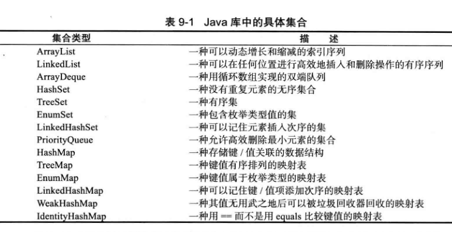
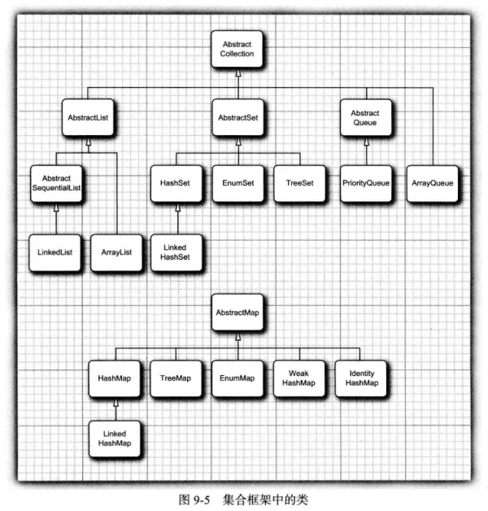
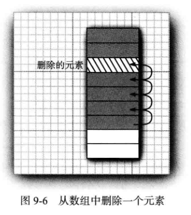
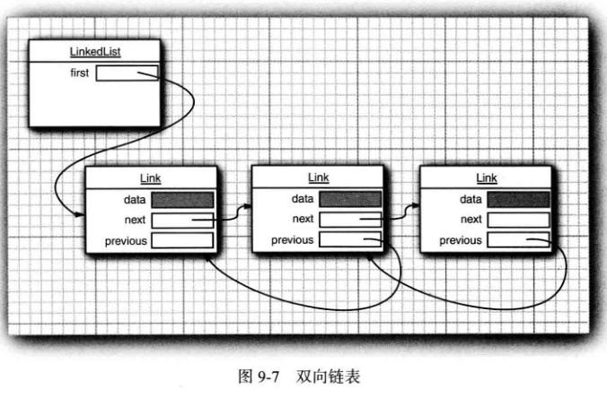
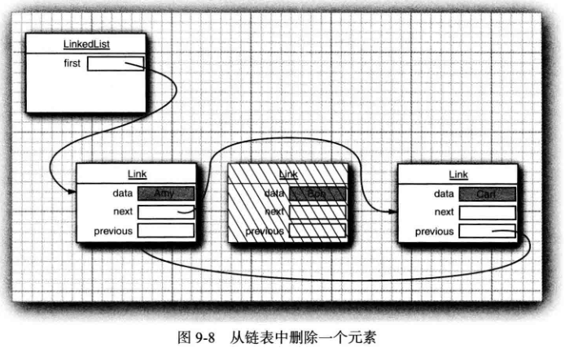
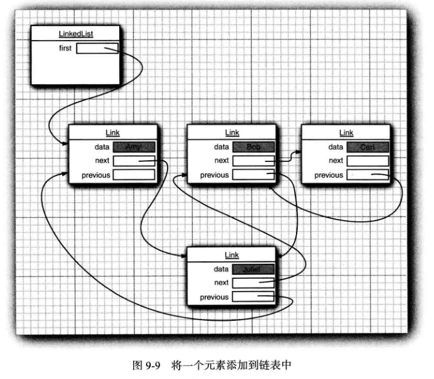
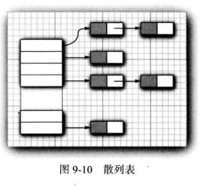
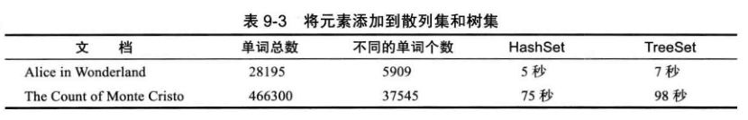

<div align=center><h1>9.2 具体的集合</h1></div>

* 表 9-1展示了 Java类库中的集合，并简要描述了每个集合类的用途（为简单起见，省略了将在第 14章中介绍的线程安全集合)。在表 9-1中，除了以 Map结尾的类之外，其他类都
现了 Collection接口，而以 Map结尾的类实现了 Map接口。

  <div align="center"></div>

  <div align="center"></div>

### 9.2.1 链 表

* 1、从**数组**的中间位置删除一个元素要付出很大的代价，其原因是数组中处于被删除元素之后的所有元素都要向数组的前端移动（见图 9-6)。在数组中间的位置上插入一个元素也是如此。
  <div align="center"></div>

* 2、**链表（linked list)** 解决了在数组中插入或删除元素开销大的问题。尽管数组在连续的存储位置上存放对象引用，但链表却**将每个对象存放在独立的结点中。每个结点还存放着序列中下一个结点的引用**。在 Java程序设计语言中，所有链表实际上都是双向链接的(doubly linked)—即每个结点还存放着指向前驱结点的引用（见图 9-7)。
  <div align="center"></div>

* 3、从链表中间删除一个元素是一个很轻松的操作，即需要更新被删除元素附近的链接（见图 9-8)。
  <div align="center"></div>

* 4、在下面的代码示例中，先添加 3 个元素，然后再将第 2个元素删除：
  ```java
  List<String> staff = new LinkedList<>(); // LinkedList implements List
  staff.add("Amy");
  staff.add("Bob");
  staff.add("Carl");
  Iterator<String> iter = staff.iterator();
  String first = iter.next();// visit first element
  String second = iter.next(); //visit second element
  iter.remove(); // remove last visited element
  ```
* 5、链表与泛型集合之间有一个重要的区别。
	* 链表是一个有序集合（ordered collection), 每个对象的位置十分重要。
	* LinkedList.add方法将对象添加到链表的尾部。但是，常常需要将元素添加到链表的中间。由于迭代器是描述集合中位置的，所以这种依赖于位置的 add方法将由迭代器负责。
	* 只有对自然有序的集合使用迭代器添加元素才有实际意义。
	* 集合类库提供了子接口 Listlterator, 其中包含 add方法：
	* 与 Collection.add不同，这个方法不返回 boolean类型的值，它假定添加操作总会改变链表。
* 6、Listlterator 接口有两个方法，可以用来反向遍历链表。与 next 方法一样，previous方法返回越过的对象。
  ```java
  E previous()
  boolean hasPrevious()
  ```
* 7、LinkedList 类的 listlterator 方法返回一个实现了 Listlterator 接口的迭代器对象。
  ```java
  ListIterator<String> iter = staff.listlterator();
  ```
* 8、Add方法在迭代器位置之前添加一个新对象。例如，下面的代码将越过链表中的第一个元素，并在第二个元素之前添加“Juliet”（见图 9-9):
  ```java
  List<String> staff = new LinkedList<>();
  staff.add("Amy");
  staff.add("Bob");
  staff.add("Carl");
  System.out.println(staff);//[Amy, Bob, Carl]

  ListIterator<String> iter = staff.listIterator();
  iter.next(); //skip past first element
  iter.add("Juliet");
 
  System.out.println(staff);//[Amy, Juliet, Bob, Carl]
  ```

  <div align="center"></div>

	* 如果多次调用 add方法，将按照提供的次序把元素添加到链表中。它们被依次添加到迭代器当前位置之前。
* 9、当用一个刚刚由 Iterator方法返回，并且指向链表表头的迭代器调用 add操作时，新添加的元素将变成列表的**新表头**。当迭代器越过链表的最后一个元素时（即 hasNext 返回 false),添加的元素将变成列表的**新表尾**。
* 10、如果链表有 n个元素，有 n+1 个位置可以添加新元素。这些位置与迭代器的 n+1个可能的位置相对应。例如，如果链表包含 3个元素，A、B、C，就有 4个位置（标有丨）可以插入新元素：
  ```java
  |A8C
  A|BC
  AB|C
  ABC|
  ```
* 11、在调用 next之后，remove方法删除了迭代器左侧的元素。但是，如果调用 previous就会将右侧的元素删除掉，**不能连续调用两次remove**。
* 12、add 方法只依赖于迭代器的位置，而 remove方法依赖于迭代器的状态。
* 13、最后需要说明，set方法用一个新元素取代调用 next 或 previous方法返回的上一个元素。例如，下面的代码将用一个新值取代链表的第一个元素：
  ```java
  ListIterator<String> iter = list.listIterator();
  String oldValue = iter.next(); // returns first element
  iter.set(newValue); // sets first element to newValue
  ```
* 14、**如果在某个迭代器修改集合时，另一个迭代器对其进行遍历，一定会出现混乱的状况**。例如，一个迭代器指向另一个迭代器刚刚删除的元素前面，现在这个迭代器就是无效的，并且不应该再使用。链表迭代器的设计使它能够检测到这种修改。如果迭代器发现它的集合被另一个迭代器修改了，或是被该集合自身的方法修改了，就会抛出一个ConcurrentModificationException异常。例如，看一看下面这段代码：
  ```java
  List<String> list = ...;
  ListIterator<String> iterl = list.listIterator();
  ListIterator<String> iter2 = list.listIterator();
  iterl.next();
  iterl.remove();
  iter2.next(); // throws ConcurrentModificationException
  ```
	* 由于 iter2检测出这个链表被从外部修改了，所以对 iter2.next 的调用抛出了一个Concurrent ModificationException异常。
* 15、为了**避免发生并发修改的异常**，请遵循下述简单规则：可以根据需要给容器附加许多的迭代器，但是这些迭代器只能读取列表。另外，再单独附加一个既能读又能写的迭代器。
* 16、有一种傅单的方法可以**检测到并发修改的问题**。集合可以跟踪改写操作（诸如添加或删除元素）的次数。每个迭代器都维护一个独立的计数值。在每个迭代器方法的开始处检查自己改写操作的计数值是否与集合的改写操作计数值一致。如果不一致，抛出一个 ConcurrentModificationException 异常。
* 17、对于并发修改列表的检测肴一个奇怪的例外。链表只负责跟踪对列表的结构性修改，例如，添加元素、删除元素。**set 方法不被视为结构性修改**。可以将多个迭代器附加给一个链表，所有的迭代器都调用 set 方法对现有结点的内容进行修改。
* 18、**链表不支持快速地随机访问**。如果要查看链表中第n个元素，就必须从头开始，越过n-1个元素。没有捷径可走。鉴于这个原因，在程序需要采用整数索引访问元素时，程序员通常不选用链表。
* 19、尽管如此，LinkedList 类还是提供了一个用来访问某个特定元素的 get 方法：
  ```java
  LinkedList<String> list = ...;
  String obj = list.get(n);
  ```
	* 当然，这个方法的效率并不太高。如果发现自己正在使用这个方法，说明有可能对于所要解决的问题使用了错误的数据结构。
	* **get方法做了微小的优化：如果索引大于 `size()/2`就从列表尾端开始搜索元素**。
* 20、绝对不应该使用这种让人误解的随机访问方法来遍历链表。下面这段代码的效率极低：
  ```java
  for (int i=0; i < list.sizeO; i++)
      do something with list.get(i);
  ```
* 21、每次査找一个元素都要从列表的头部重新开始搜索。LinkedList对象根本不做任何缓存位置信息的操作。
* 22、列表迭代器接口还有一个方法，可以告之当前位置的索引。实际上，从概念上讲，由于Java迭代器指向两个元素之间的位置，所以可以同时产生两个索引：
	* nextlndex方法返回下一次调用 next 方法时返回元素的整数索引；
	* previouslndex方法返回下一次调用 previous 方法时返回元素的整数索引。当然，这个索引只比 nextlndex返回的索引值小 1。
	* **这两个方法的效率非常高，这是因为迭代器保持着当前位置的计数值**。
* 23、如果有一个整数索引n,list.listlterator(n)将返回一个迭代器，这个迭代器指向索引为 n的元素前面的位置。也就是说，调用 next 与调用 list.get(n) 会产生同一个元素，只是获得这个迭代器的效率比较低。
* 24、如果链表中只有很少几个元素，就完全没有必要为 get 方法和 set方法的开销而烦恼。
* 25、**为什么要优先使用链表呢？ 使用链表的唯一理由是尽可能地减少在列表中间插人或删元素所付出的代价。如果列表只有少数几个元素，就完全可以使用 ArrayList**。
* 26、避免使用以整数索引表示链表中位置的所有方法。如果需要对集合进行随机访问，就使用数组或 ArrayList, 而不要使用链表。
* 27、**LinkedList线程不安全（没有初始化大小，也没有扩容的机制）便于插入、删除；以 Entry对象为节点，实现了双向链表**

```java
package com.edu.test.collection;

import java.util.Iterator;
import java.util.LinkedList;
import java.util.List;
import java.util.ListIterator;

/**
 * @Author: 王仁洪
 * @Date: 2019/3/28 9:24
 */
public class LinkedListTest {
    public static void main(String[] args) {
        List<String> lista = new LinkedList<>();
        lista.add("Any");
        lista.add("Carl");
        lista.add("Erica");

        List<String> listb = new LinkedList<>();
        listb.add("Bob");
        listb.add("Doug");
        listb.add("Frances");
        listb.add("Gloria");

        System.out.println("init lista " + lista);//[Any, Carl, Erica]
        System.out.println("init listb " + listb);//[Bob, Doug, Frances, Gloria]

        ListIterator<String> iteratora = lista.listIterator();
        Iterator<String> iteratorb = listb.iterator();

        //merge the words from b into a
        while (iteratorb.hasNext()){
            if (iteratora.hasNext()){
                iteratora.next();
            }
            iteratora.add(iteratorb.next());
        }
        System.out.println("add listb to lista " + lista);//[Any, Bob, Carl, Doug, Erica, Frances, Gloria]

        // remove every second word from b
        iteratorb = listb.iterator();
        while (iteratorb.hasNext()){
            iteratorb.next();// skip one element
            if (iteratorb.hasNext()){
                iteratorb.next(); // skip next element
                iteratorb.remove();// remove that element
            }
        }

        System.out.println("remove from listb " + listb);//[Bob, Frances]

        // bulk operation: remove all words in b from a
        lista.removeAll(listb);
        System.out.println("remove in listb from lista " + lista);//[Any, Carl, Doug, Erica, Gloria]
    }
}
```

### 9.2.2 数组列表

 * 1、List 接口用于描述一个有序集合，并且集合中每个元素的位置十分重要。
 * 2、有两种访问元素的协议：
 	* 一种是用迭代器，
 	* 另一种是用get 和 set 方法随机地访问每个元素。不适用于链表，但对数组却很有用。
 * 3、ArrayList 封装了一个动态再分配的对象数组。
 * 4、**在需要动态数组时，可能会使用Vector 类**。为什么要用 ArrayList 取代Vector呢？ 原因很简单：Vector 类的所有方法都是同步的。可以由两个线程安全地访问一个 Vector 对象。但是，如果由一个线程访问 Vector, 代码要在同步操作上耗费大量的时间。这种情况还是很常见的。
 * 5、ArrayList 方法不是同步的，因此，建议在不需要同步时使用 ArrayList, 而不要使用 Vector。
 * 6、**ArrayList与Vector默认大小是10**
 * 7、**ArrayList线程不安全（默认大小10，扩容为原容量0.5倍）；查询速度快，底层数据结构是数组结构**
 * 8、**Vector线程安全（默认大小10，扩容为原容量的一倍）；速度慢，底层数据结构是数组结构；加载因子为1：即当 元素个数 超过 容量长度 时，进行扩容**
 * 9、**ArrayDeque线程不安全（默认大小16，按照2倍方式扩容）便于遍历；以循环数组形式实现的队列；不能存储null；支持双向迭代器遍历**


### 9.2.3 散列集

* 1、链表和数组可以按照人们的意愿排列元素的次序。但是，如果想要査看某个指定的元素，却又忘记了它的位置，就需要访问所有元素，直到找到为止。如果集合中包含的元素很多，将会消耗很多时间。如果不在意元素的顺序，可以有几种能够快速査找元素的数据结构。**其缺点是无法控制元素出现的次**序。它们将按照有利于其操作目的的原则组织数据。
* 2、有一种众所周知的数据结构，可以快速地査找所需要的对象，这就是**散列表（hash table)**。
* 3、散列表为每个对象计算一个整数，称为**散列码（hashcode)**。散列码是由对象的实例域产生的一个整数。更准确地说，**具有不同数据域的对象将产生不同的散列码**。
* 4、表 9-2列出了几个散列码的示例，它们是由 String 类的 hashCode方法产生的。
  <div align="center"></div>

* 5、如果自定义类，就要负责实现这个类的hashCode方法。注意，自己实现的 hashCode方法应该与 equals方法兼容，即如果a.equals(b) 为true, a 与 b 必须具有相同的散列码。
* 6、在 Java 中，**散列表用链表数组实现**。每个列表被称为桶（bucket) (参看图 9-10)。
  <div align="center"></div>
* 7、**要想査找表中对象的位置，就要先计算它的散列码，然后与桶的总数取余，所得到的结果就是保存这个元素的桶的索引**。例如，如果某个对象的散列码为 76268, 并且有 128 个桶，对象应该保存在第 108号桶中（76268除以 128余 108)。
	* 或许会很幸运，在这个桶中没有其他元素，此时将元素直接插人到桶中就可以了。
	* 当然，有时候会遇到桶被占满的情况，这也是不可避免的。这种现象被称为散列冲突（hash collision)。 这时，需要用新对象与桶中的所有对象进行比较，査看这个对象是否已经存在。**如果散列码是合理且随机分布的，桶的数目也足够大，需要比较的次数就会很少**。
* 8、在 JavaSE8中，桶满时会从链表变为平衡二叉树。如果选择的散列函数不当，会产生很多冲突，或者如果有恶意代码试图在散列表中填充多个有相同散列码的值，这样就能提高性能。
* 9、如果想更多地控制散列表的运行性能，就要指定一个初始的桶数。桶数是指用于收集具有相同散列值的桶的数目。如果要插入到散列表中的元素太多，就会增加冲突的可能性，降低运行性能。
* 10、如果大致知道最终会有多少个元素要插人到散列表中，就可以设置桶数。通常，将桶数设置为预计元素个数的 75% ~ 150%。
* 11、有些研究人员认为：尽管还没有确凿的证据，但最好将桶数设置为一个素数，以防键的集聚。**标准类库使用的桶数是 2的幂，默认值为 16** (为表大小提供的任何值都将被自动地转换为 2 的下一个幂)。
* 12、当然，并不是总能够知道需要存储多少个元素的，也有可能最初的估计过低。如果散列表太满，就需要再散列 （rehashed)。如果要对散列表再散列，就需要创建一个桶数更多的表，并将所有元素插入到这个新表中，然后丢弃原来的表。
* 13、装填因子（load factor) 决定何时对散列表进行再散列。例如，如果装填因子为 0.75 (默认值)，而表中超过 75%的位置已经填人元素，这个表就会用双倍的桶数自动地进行再散列。对于大多数应用程序来说，装填因子为0.75是比较合理的。
* 14、**散列表可以用于实现几个重要的数据结构**。其中最简单的是 set 类型。set 是没有重复元素的元素集合。set 的 add方法首先在集中查找要添加的对象，如果不存在，就将这个对象添加进去。
* 15、Java集合类库提供了一个 HashSet类，它实现了基于散列表的集。可以用 add方法添加元素。contains方法已经被重新定义，用来快速地查看是否某个元素已经出现在集中。它只在某个桶中査找元素，而不必查看集合中的所有元素。
* 16、**散列集迭代器将依次访问所有的桶**。由于散列将元素分散在表的各个位置上，所以访问它们的顺序几乎是随机的。只有不关心集合中元素的顺序时才应该使用 HashSet。
* 17、**HashSet线程不安全（默认大小16，扩容为原容量的一倍）;存取速度快,底层实现是一个HashMap（保存数据），实现Set接口,加载因子为0.75：即当 元素个数 超过 容量长度的0.75倍 时，进行扩容**

### 9.2.4 树集

* 1、TreeSet类与散列集十分类似，不过，它比散列集有所改进。树集是一个有序集合(sorted collection)o。可以以任意顺序将元素插入到集合中。在对集合进行遍历时，每个值将自动地按照排序后的顺序呈现。例如，假设插入 3个字符串，然后访问添加的所有元素。
  ```java
  SortedSet<String> sorter = new TreeSet(); // TreeSet implements SortedSet
  sorter.add("Bob");
  sorter.add("Amy");
  sorter.add("Carl");
  for (String s : sorter)
      System.out.println(s);
  ```
	* 这时，每个值将按照顺序打印出来：Amy Bob Carl。
	* 正如 TreeSet 类名所示，排序是用树结构完成的（当前实现使用的是**红黑树**（red-black tree)。
	* 每次将一个元素添加到树中时，都被放置在正确的排序位置上。因此，迭代器总是以排好序的顺序访问每个元素。
* 2、将一个元素添加到树中要比添加到散列表中慢，参见表 9-3中的比较，但是，与检查数组或链表中的重复元素相比还是快很多。如果树中包含 n 个元素，査找新元素的正确位置平均需要 l0g2n 次比较。例如，如果一棵树包含了 1000 个元素，添加一个新元素大约需要比较10次。
  <div align="center"></div>

* 3、要使用树集，必须能够比较元素。这些元素必须实现 Comparable接口,或者构造集时必须提供一个 Comparator。
* 4、是否总是应该用树集取代散列集。毕竟，添加一个元素所花费的时间看上去并不很长，而且元素是自动排序的。**到底应该怎样做将取决于所要收集的数据。如果不需要对数据进行排序，就没有必要付出排序的开销**。
* 5、从 JavaSE 6起，TreeSet 类实现了 NavigableSet接口。这个接口增加了几个便于定位元素以及反向遍历的方法。

```java
package com.edu.test.collection;

import java.util.*;

/**
 * @Author: 王仁洪
 * @Date: 2019/3/28 20:25
 */
public class TreeSetTest {
    public static void main(String[] args) {
        SortedSet<Item> parts = new TreeSet<>();
        parts.add(new Item("Toaster",1234));
        parts.add(new Item("Widget",4562));
        parts.add(new Item("Modem",9912));
        System.out.println(parts);//[[description=Toaster,partNumber=1234, [description=Widget,partNumber=4562, [description=Modem,partNumber=9912]

        NavigableSet<Item> sortByDescription = new TreeSet<>(Comparator.comparing(Item::getDescription));
        sortByDescription.addAll(parts);
        System.out.println(sortByDescription);//[[description=Modem,partNumber=9912, [description=Toaster,partNumber=1234, [description=Widget,partNumber=4562]
    }
}

class Item implements Comparable<Item>{
    private String description;
    private int partNumber;

    public Item(String description,int partNumber){
        this.description = description;
        this.partNumber = partNumber;
    }

    public String getDescription(){
        return description;
    }
    @Override
    public String toString(){
        return "[description=" + description + ",partNumber=" + partNumber;
    }

    @Override
    public int hashCode() {
        return Objects.hash(description,partNumber);
    }

    @Override
    public boolean equals(Object obj) {
        if (this==obj)
            return true;
        if (null==obj)
            return false;
        if (getClass()!=obj.getClass())
            return false;
        Item item = (Item)obj;
        return Objects.equals(description,item.description) && partNumber==item.partNumber;
    }

    @Override
    public int compareTo(Item other) {
        int diff = Integer.compare(partNumber,other.partNumber);
        return diff != 0 ? diff : description.compareTo(other.description);
    }
}
```

### 9.2.5 队列与双端队列

* 1、队列可以让人们有效地在尾部添加一个元素，在头部删除一个元素。
* 2、**有两个端头的队列，即双端队列**，可以让人们有效地在头部和尾部同时添加或删除元素。不支持在队列中间添加元素。
* 3、在 JavaSE 6中引人了 Deque接口，并由 ArrayDeque（**循环数组实现**）和LinkedList（**链表实现**） 类实现。这两个类都提供了双端队列，而且在必要时可以增加队列的长度。 


### 9.2.6 优先级队列

* 1、优先级队列（priorityqueue) 中的元素可以按照任意的顺序插人，却总是按照排序的顺序进行检索。
* 2、也就是说，无论何时调用 remove方法，总会获得当前优先级队列中最小的元素。
* 3、然而，优先级队列并没有对所有的元素进行排序。
* 4、如果用迭代的方式处理这些元素，并不需要对它们进行排序。
* 5、优先级队列使用了一个优雅且高效的数据结构，称为堆（heap)。堆是一个可以自我调整的二叉树，对树执行添加（add) 和删除（remore) 操作，可以让最小的元素移动到根，而不必花费时间对元素进行排序。
* 6、与 TreeSet —样，一个优先级队列既可以保存实现了 Comparable接口的类对象，也可以保存在构造器中提供的 Comparator 对象。
* 7、使用优先级队列的典型示例是任务调度。每一个任务有一个优先级，任务以随机顺序添加到队列中。每当启动一个新的任务时，都将优先级最高的任务从队列中删除（由于习惯上将 1设为“ 最高” 优先级，所以会将最小的元素删除)。

```java
package com.edu.test.collection;

import java.time.LocalDate;
import java.util.PriorityQueue;

/**
 * @Author: 王仁洪
 * @Date: 2019/3/28 20:45
 */
public class PriorityQueueTest {
    public static void main(String[] args) {
        PriorityQueue<LocalDate> priorityQueue = new PriorityQueue<>();
        priorityQueue.add(LocalDate.of(1906,12,9));
        priorityQueue.add(LocalDate.of(1815,12,10));
        priorityQueue.add(LocalDate.of(1903,12,3));
        priorityQueue.add(LocalDate.of(1910,6,22));

        System.out.println("Iterating over elements...");
        for (LocalDate date : priorityQueue){
            System.out.println(date);
        }

        System.out.println("Removing elements...");
        while (!priorityQueue.isEmpty()){
            System.out.println(priorityQueue.remove());
        }

        /**
         * Iterating over elements...
         * 1815-12-10
         * 1906-12-09
         * 1903-12-03
         * 1910-06-22
         * Removing elements...
         * 1815-12-10
         * 1903-12-03
         * 1906-12-09
         * 1910-06-22
         */
    }
}
```


