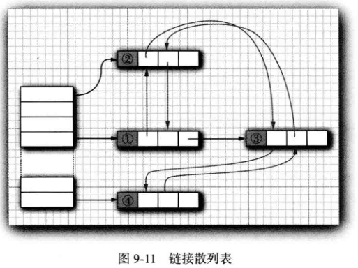

<div align=center><h1>9.3 映射</h1></div>

### 9.3.1 基本映射操作(HashMap和TreeMap)

* 1、Java类库为映射提供了两个通用的实现：HashMap和TreeMap。这两个类都实现了 Map接口。
* 2**、散列映射（HashMap）对键进行散列，树映射（TreeMap）用键的整体顺序对元素进行排序，并将其组织成搜索树**。
* 3、**散列或比较函数只能作用于键。与键关联的值不能进行散列或比较**。
* 4、应该选择散列映射还是树映射呢？ 与集一样，散列稍微快一些，如果不需要按照排列顺序访问键，就最好选择散列。
* 5、要想检索一个对象，必须使用（因而，必须记住）一个键。
* 6、如果在映射中没有与给定键对应的信息，get 将返回 null。
* 7、null 返回值可能并不方便。有时可以有一个好的默认值，用作为映射中不存在的键。然后使用 getOrDefault 方法。
* 8、**键必须是唯一的。不能对同一个键存放两个值**。如果对同一个键两次调用 put 方法，第二个值就会取代第一个值。实际上，put 将返回用这个键参数存储的上一个值。
  ```java
  Map<String,Integer> map = new HashMap<>();
  Integer put1 = map.put("1", 1);
  Integer put2 = map.put("1", 2);
  System.out.println(put1);//null
  System.out.println(put2);//1
  ```
* 9、remove方法用于从映射中删除给定键对应的元素。
* 10、size方法用于返回映射中的元素数。
* 11、要迭代处理映射的键和值，最容易的方法是使用 forEach方法。可以提供一个接收键和值的 lambda表达式。映射中的每一项会依序调用这个表达式。
  ```java
  Map<String,Integer> map = new HashMap<>();
  Integer put1 = map.put("1", 1);
  Integer put2 = map.put("2", 2);
  map.forEach((k, v) ->
        System.out.println("key=" + k + ", value:" + v));
  ```

```java
程序清单9-6

package com.edu.test.collection;

import java.util.HashMap;
import java.util.Map;

/**
 * @Author: 王仁洪
 * @Date: 2019/3/28 22:09
 */
public class MapTest {
    public static void main(String[] args) {
        Map<String, Employee> staff = new HashMap<>();
        staff.put("144-25-5464", new Employee("Amy Lee"));
        staff.put("567-24-2546", new Employee("Harry Hacker"));
        staff.put("157-62-7935", new Employee("Cary Cooper"));
        staff.put("456-62-5527", new Employee("Francesca Cruz"));
        // print all entries
        System.out.println(staff);
        //{157-62-7935=Employee{name='Cary Cooper'}, 144-25-5464=Employee{name='Amy Lee'}, 456-62-5527=Employee{name='Francesca Cruz'}, 567-24-2546=Employee{name='Harry Hacker'}}

        // remove an entry
        staff.remove("567-24-2546");
        System.out.println(staff);
        //{157-62-7935=Employee{name='Cary Cooper'}, 144-25-5464=Employee{name='Amy Lee'}, 456-62-5527=Employee{name='Francesca Cruz'}}

        // replace an entry
        Employee emp = staff.put("456-62-5527", new Employee("Francesca Hiller"));
        System.out.println(emp);//Employee{name='Francesca Cruz'}
        System.out.println(staff);
        //{157-62-7935=Employee{name='Cary Cooper'}, 144-25-5464=Employee{name='Amy Lee'}, 456-62-5527=Employee{name='Francesca Hiller'}}

        // look up a value
        Employee employee = staff.get("157-62-7935");
        System.out.println(employee);//Employee{name='Cary Cooper'}

        // iterate through all entries
        staff.forEach((k,v)->
                System.out.println("key=" + k + ",value=" + v));
        /**
         * key=157-62-7935,value=Employee{name='Cary Cooper'}
         * key=144-25-5464,value=Employee{name='Amy Lee'}
         * key=456-62-5527,value=Employee{name='Francesca Hiller'}
         */
    }
}
class Employee{
    private String name;
    public Employee(String name){
        this.name = name;
    }

    @Override
    public String toString() {
        return "Employee{" +
                "name='" + name + '\'' +
                '}';
    }
}
```

### 9.3.2 更新映射项

* 1、处理映射时的一个难点就是更新映射项。正常情况下，可以得到与一个键关联的原值，完成更新，再放回更新后的值。不过，必须考虑一个特殊情况，即键第一次出现。
* 2、有一种情况除外：就是第一次看到 word时。在这种情况下，get 会返回 null, 因此会出现一个 NullPointerException异常。

### 9.3.3 映射视图

* 1、集合框架不认为映射本身是一个集合。（其他数据结构框架认为映射是一个`键/值`对集合，或者是由键索引的值集合。）不过，可以得到映射的视图（View)—这是实现了Collection接口或某个子接口的对象。
* 2、有 3 种视图：键集、值集合（不是一个集）以及`键/值`对集。键和`键/值`对可以构成一个集，因为映射中一个键只能有一个副本。
* 3、下面的方法：会分别返回这 3 个视图。（条目集的元素是实现 Map.Entry 接口的类的对象。）
  ```java
  Set<K> keySet();
  //返回映射中所有键的一个集视图。可以从这个集中删除元素，键和相关联的值将从映射中删除，但是不能增加任何元素。
  Collection<V> values()
  //返回映射中所有值的一个集合视图。可以从这个集合中删除元素，所删除的值及相应的键将从映射中删除，不过不能增加任何元素。
  Set<Map.Entry<K, V>> entrySet()
  //返回 Map.Entry对象（映射中的键/值对）的一个集视图。可以从这个集中删除元素，它们将从映射中删除，但是不能增加任何元素。
  ```
* 4、需要说明的是，keySet不是 HashSet 或 TreeSet，而是实现了 Set接口的另外某个类的对象。
* 5、Set接口扩展了 Collection接口。因此，可以像使用集合一样使用 keySet。例如，可以枚举一个映射的所有键：
  ```java
  Set<String> keys = map.keySet();
  for (String key : keys) {
      do something with key
  }
  ```
* 6、如果想同时查看键和值，可以通过枚举条目来避免查找值。使用以下代码：
  ```java
  for (Map.Entry<String, Employee> entry : staff.entrySet()){
      String k = entry.getKey()
      Employee v = entry.getValue();
      do something with k, v
  }
  ```
	* 原先这是访问所有映射条目的最高效的方法。如今，只需要使用 forEach 方法：
	  ```
	  counts.forEach((k, v)-> {
           do something with k, v
	  });
	  ```
* 7、如果在键集视图上调用迭代器的 remove方法，实际上会从映射中删除这个键和与它关联的值。
* 8、不能向键集视图增加元素。
* 9、如果增加一个键而没有同时增加值也是没有意义的。
* 10、如果试图调用 add方法，它会抛出一个 UnsupportedOperationException。
* 11、条目集视图有同样的限制，尽管理论上增加一个新的`键/值`对好像是有意义的。


### 9.3.4 弱散列映射(WeakHashMap)

* 1、在集合类库中有几个专用的映射类。
* 2、设计 WeakHashMap类是为了解决一个有趣的问题。
	* 有一个值，对应的键已经不再使用了，将会出现什么情况呢？ 假定对某个键的最后一次引用已经消亡，不再有任何途径引用这个值的对象了。但是，由于在程序中的任何部分没有再出现这个键，所以，这个键/值对无法从映射中删除。
* 3、垃圾回收器跟踪活动的对象。只要映射对象是活动的，其中的所有桶也是活动的，它们不能被回收。
* 4、需要由程序负责从长期存活的映射表中删除那些无用的值。或者使用 WeakHashMap完成这件事情。
* 5、当对键的唯一引用来自散列条目时，这一数据结构将与垃圾回收器协同工作一起删除键/值对。
* 6、这种机制的内部运行情况：
	* WeakHashMap使用弱引用（weak references) 保存键。
	* WeakReference对象将引用保存到另外一个对象中，在这里，就是散列键。
	* 对于这种类型的对象，垃圾回收器用一种特有的方式进行处理。
	* 通常，如果垃圾回收器发现某个特定的对象已经没有他人引用了，就将其回收。
	* 然而，**如果某个对象只能由 WeakReference引用，垃圾回收器仍然回收它，但要将引用这个对象的弱引用放人队列中**。
	* WeakHashMap将周期性地检查队列，以便找出新添加的弱引用。
	* 一个弱引用进人队列意味着这个键不再被他人使用，并且已经被收集起来。于是，WeakHashMap将删除对应的条目。

### 9.3.5 链接散列集与映射(LinkedHashSet,LinkedHashMap)

* 1、LinkedHashSet 和LinkedHashMap类用来记住插人元素项的顺序。
* 2、这样就可以避免 在散列表中的项 从表面上看 是随机排列的。当条目插入到表中时，就会并人到双向链表中（见图 9-11)。
  <div align="center"></div>

	* 例如，在程序清单 9-6中包含下列映射表插入的处理:
	  ```java
        Map<String, Employee> staff = new HashMap<>();
        staff.put("144-25-5464", new Employee("Amy Lee"));
        staff.put("567-24-2546", new Employee("Harry Hacker"));
        staff.put("157-62-7935", new Employee("Cary Cooper"));
        staff.put("456-62-5527", new Employee("Francesca Cruz"));
	  ```
	* 然后，`staff.keySet().iterator()` 以下面的次序枚举键：
	  ```java
	  144-25-5464
	  567-24-2546
	  157-62-7935
	  456-62-5527
	  ```
	* staff.values().iterator() 以下列顺序枚举这些值：
	  ```java
	  Amy Lee
	  Harry Hacker
	  Gary Cooper
	  Francesca Cruz
	  ```
* 3、链接散列映射将用访问顺序，而不是插入顺序，对映射条目进行迭代。
	* 每次调用 get 或 put, 受到影响的条目将从当前的位置删除，并放到条目链表的尾部（只有条目在链表中的位置会受影响，而散列表中的桶不会受影响。一个条目总位于与键散列码对应的桶中）。
	* 要想构造这样一个的散列映射表，请调用：
	  ```java
	  LinkedHashMap<K, V>(initialCapacity, loadFactor, true)
	  LinkedHashMap(int initialCapacity, float loadFactor, boolean accessOrder)
	  ```
		* 用给定的容量、填充因子和顺序构造一个空的链接散列映射表。**accessOrder 参数为true时表示访问顺序，为 false时表示插入顺序**。
* 4、访问顺序对于实现高速缓存的“ 最近最少使用”原则十分重要。
	* 例如，可能希望将访问频率高的元素放在内存中，而访问频率低的元素则从数据库中读取。 
	* 当在表中找不到元素项且表又已经满时，可以将迭代器加入到表中，并将枚举的前几个元素删除掉。这些是近期最少使用的几个元素。
* 5、甚至可以让这一过程自动化。即构造一个LinkedHashMap的子类，然后覆盖下面这个方法：
  ```java
  protected boolean removeEldestEntry(Map.Entry<K, V> eldest)
  ```
	* 每当方法返回 true时，就添加一个新条目，从而导致删除 eldest 条目。
	* 例如，下面的高速缓存可以存放 100个元素：
	  ```java
      Map<String, String> cache = new LinkedHashMap<String, String>(128, 0.75F, true) {
             protected boolean removeEldestEntry(Map.Entry<String, String> eldest) {
                  return size() > 100;
             }
      };
	  ```
		* 另外，还可以对 eldest 条目进行评估，以此决定是否应该将它删除。例如，可以检査与这个条目一起存在的时间戳。

### 9.3.6 枚举集与映射（EnumSet，EnumMap）

* 1、EnumSet是一个枚举类型元素集的高效实现。
* 2、由于枚举类型只有有限个实例，所以EnumSet 内部用位序列实现。如果对应的值在集中，则相应的位被置为 1。
* 3、EnumSet 类没有公共的构造器。可以使用静态工厂方法构造这个集：
  ```java
  enum Weekday { 
      MONDAY, TUESDAY, WEDNESDAY, THURSDAY, FRIDAY, SATURDAY, SUNDAY 
  };
  EnumSet<Weekday> always = EnumSet.allOf(Weekday.class);
  EnumSet<Weekday> never = EnumSet.noneOf(Weekday.class);
  EnumSet<Weekday>workday = EnumSet.range(Weekday.MONDAY, Weekday.FRIDAY);
  EnumSet<Weekday> mwf = EnumSet.of(Weekday.MONDAY, Weekday.WEDNESDAY, Weekday.FRIDAY);
  ```
* 4、可以使用 Set 接口的常用方法来修改 EnumSet。
* 5、EnumMap是一个键类型为枚举类型的映射。它可以直接且高效地用一个值数组实现。
在使用时，需要在构造器中指定键类型：
  ```java
  EnumMap<Weekday, Employee> personlnCharge = new EnumMapo(Weekday.class);
  ```
* 6、在 EnumSet 的 API 文档中，将会看到 E extends Enum<E> 这样奇怪的类型参数。简单地说，它的意思是 “E 是一个枚举类型。” 所有的枚举类型都扩展于泛型 Enum 类。例如，Weekday 扩展`Enum<Weekday〉`。

### 9.3.7 标识散列映射（IdentityHashMap）
* 1、类 IdentityHashMap 有特殊的作用。在这个类中，键的散列值不是用 hashCode 函数计算的，而是用 System.identityHashCode 方法计算的。
* 2、这是 Object.hashCode 方法根据对象的内存地址来计算散列码时所使用的方式。
* 3、在对两个对象进行比较时，IdentityHashMap 类使用`==`, 而不使用 equals。也就是说，不同的键对象，即使内容相同，也被视为是不同的对象。
* 4、在实现**对象遍历算法**（如对象串行化）时，这个类非常有用，可以用来跟踪每个对象的遍历状况。


