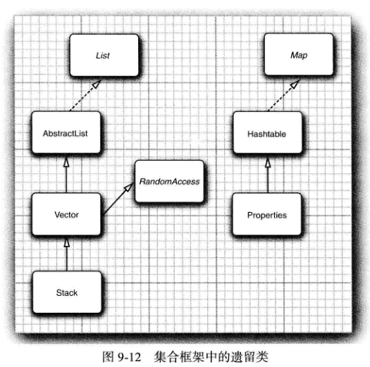

<div align=center><h1>9.6 遗留的集合</h1></div>

* 从 Java第 1版问世以来，在集合框架出现之前已经存在大量“ 遗留的”容器类。这些类已经集成到集合框架中，如图 9-12所示。
<div align="center"></div>

### 9.6.1 Hashtable 类
* 1、Hashtable类与 HashMap类的作用一样，实际上，它们拥有相同的接口。
  ```java
  public class HashMap<K,V> extends AbstractMap<K,V>
           implements Map<K,V>, Cloneable, Serializable {

  }
  public class Hashtable<K,V> extends Dictionary<K,V>
           implements Map<K,V>, Cloneable, java.io.Serializable {

  }
  ```
* 2、与 Vector 类的方法一样。Hashtable的方法也是**同步**的。
* 3、如果对同步性或与遗留代码的兼容性没有任何要求，就应该使用 HashMap。
* 4、如果需要并发访问，则要使用 ConcurrentHashMap

### 9.6.2 枚举(Enumeration 接口)
* 1、**传递集合要比传递迭代器更为明智**。集合对象的用途更大。当接受方如果需要时，总是可以从集合中获得迭代器，而且，还可以随时地使用集合的所有方法。

### 9.6.3 属性映射
* 属性映射（property map) 是一个类型非常特殊的映射结构。它有下面 3个特性：
	* 键与值都是字符串。
	* 表可以保存到一个文件中，也可以从文件中加载。
	* 使用一个默认的辅助表。
* 实现属性映射的 Java平台类称为 Properties。
* 属性映射通常用于程序的特殊配置选项。

### 9.6.4 栈
* 从 1.0版开始，标准类库中就包含了 Stack类，其中有大家熟悉的 push方法和 pop方法。
* 但是，Stack类扩展为 Vector类，从理论角度看，Vector类并不太令人满意，它可以让栈使用不属于栈操作的 insert 和 remove方法，即可以在任何地方进行插入或删除操作，而不仅仅是在栈顶。


### 9.6.5 位集（BitSet类）
* Java平台的 BitSet类用于存放一个位序列（它不是数学上的集，称为位向量或位数组更为合适)。
* 如果需要高效地存储位序列（例如，标志）就可以使用位集。
* 由于位集将位包装在字节里，所以，使用位集要比使用 Boolean对象的 ArrayList 更加高效。
* BitSet 类提供了一个便于读取、设置或清除各个位的接口。使用这个接口可以避免屏蔽和其他麻烦的位操作。
* 如果将这些位存储在 int 或 long变量中就必须进行这些繁琐的操作。
* 例如，对于一个名为 bucketOfBits的 BitSet,
  ```java
  bucketOfBits.get(i)
  如果第 i 位处于 “开” 状态，就返回 true; 否则返回 false。同样地，

  bucketOfBits.set(i)
  将第 i 位置为 “开” 状态。最后，

  bucketOfBits.clear(i)
  将第 i 位置为 “关” 状态。
  ```

```java
package com.edu.test.collection;

import java.util.BitSet;

/**
 * @Author: 王仁洪
 * @Date: 2019/3/31 20:25
 */
public class Sieve {
    public static void main(String[] args) {
        int n = 2000000;
        long start = System.currentTimeMillis();
        BitSet bitSet = new BitSet(n + 1);
        int count = 0;

        int i;
        for (i=2;i<=n;i++){
            bitSet.set(i);
        }
        i = 2;
        while (i*i <= n){
            if (bitSet.get(i)){
                count++;
                int k = 2 * i;
                while (k <= n){
                    bitSet.clear(k);
                    k += i;
                }
            }
            i++;
        }

        while (i<=n){
            if (bitSet.get(i)){
                count++;
            }
            i++;
        }

        long end = System.currentTimeMillis();
        System.out.println(count + " primes");
        System.out.println(end - start + "milliseconds");
    }
}
```


