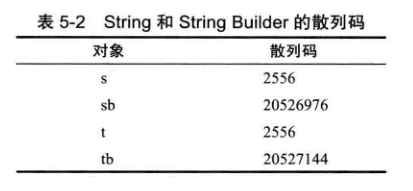

<div align=center><h1>5.2  Object：所有类的超类</h1></div>

* 1、Object类是 Java中所有类的始祖，在 Java中每个类都是由它扩展而来的。
* 2、如果没有明确地指出超类，Object 就被认为是这个类的超类。
* 3、可以使用 Object类型的变量引用任何类型的对象：
  ```java
  Object obj = new EmployeeC'Harry Hacker", 35000);
  ```
* 4、Object 类型的变量只能用于作为各种值的通用持有者。要想对其中的内容进行具体的操作，还需要清楚对象的原始类型，并进行相应的类型转换：
  ```java
  Employee e = (Employee) obj;
  ```
* 5、在 Java中，只有基本类型 （primitive types) 不是对象，例如，数值、字符和布尔类型的值都不是对象。
* 6、所有的数组类塱，不管是对象数组还是基本类型的数组都扩展了 Object 类。
  ```java
  Employee[] staff = new Employee[10];
  obj = staff; // OK
  obj = new int[10]; //OK
  ```

### 5.2.1 equals方法

* 1、Object类中的 equals方法用于检测一个对象是否等于另外一个对象。在Object 类中，这个方法将判断两个对象是否具有相同的引用。如果两个对象具有相同的引用，它们一定是相等的。
* 2、getClass方法将返回一个对象所属的类，在检测中，只有在两个对象属于同一个类时，才有可能相等。

### 5.2.2 相等测试与继承

* 1、Java 语言规范要求 equals 方法具有下面的特性：
	* 1)自反性：对于任何非空引用 x, x.equals(x）应该返回true。
	* 2)对称性: 对于任何引用 x 和 y, 当且仅当 y.equals(x)返回 true, x.equals(y) 也应该返回 true。
	* 3)传递性：对于任何引用x、y 和 z, 如果x.equals(y)返回 true，y.equals(z)返回 true,x.equals(z)也应该返回 true。
	* 4)一致性：如果x 和 y引用的对象没有发生变化，反复调用 x.eqimIS(y) 应该返回同样的结果。
	* 5)对于任意非空引用 x, x.equals(null)应该返回 false,
* 2、从两个截然不同的情况看一下当参数不属于同一个类的时候的相等这个问题：
	* 如果**子类**能够拥有自己的相等概念，则对称性需求将强制采用 getClass 进行检测。
	* 如果由**超类决定**相等的概念，那么就可以使用 imtanceof进行检测，这样可以在不同子类的对象之间进行相等的比较。
* 3、**编写一个完美的 equals方法的建议**：
	* 1)显式参数命名为 otherObject, 稍后需要将它转换成另一个叫做 other 的变量。
	* 2)检测 this与 otherObject 是否引用同一个对象：
	  ```java
	  if (this == otherObject) return true;
	  ```
		* 这条语句只是一个优化。实际上，这是一种经常采用的形式。因为计算这个等式要比一个一个地比较类中的域所付出的代价小得多。
	* 3)检测 otherObject是否为 null, 如 果 为 null, 返 回 false。这项检测是很必要的。
	  ```java
	  if (otherObject = null) return false;
	  ```
	* 4)比较 this与 otherObject是否属于同一个类。如果equals的语义在每个子类中有所改变，就使用 getClass检测：
	  ```java
	  if (getClass() != otherObject.getCIass()) return false;
	  如果所有的子类都拥有统一的语义，就使用 instanceof 检测：
	  if (!(otherObject instanceof ClassName)) return false;
	  ```
	* 5)将 otherObject转换为相应的类类型变量：
	  ```java
	  ClassName other = (ClassName) otherObject
	  ```
	* 6)现在开始对所有需要比较的域进行比较了。使用=比较基本类型域，使用 equals比较对象域。如果所有的域都匹配，就返回 true; 否则返回 false。
	  ```java
	  return fieldl == other.field
	         && Objects.equals(fie1d2, other.field2)
	         && ......
	  ```
		* 如果在子类中重新定义 equals, 就要在其中包含调用super.equals(other)。

### 5.2.3 hashCode 方法

* 1、散列码（ hash code) 是由对象导出的一个整型值。散列码是没有规律的。如果 x 和 y 是两个不同的对象，x.hashCode( ) 与 y.hashCode( ) 基本上不会相同。
* 2、字符串 s与 t 拥有相同的散列码，这是因为字符串的散列码是由内容导出的。而字符串缓冲 sb与 tb却有着不同的散列码，这是因为在 StringBuffer类中没有定义hashCode方法，它的散列码是由 Object 类的默认 hashCode方法导出的对象存储地址。
  ```java
  String s = "Ok";
  StringBuilder sb = new StringBuilder(s);
  System.out.println(s.hashCode() + " " + sb.hashCode());

  String t = new String("Ok");
  StringBuilder tb = new StringBuilder(t)；
  System.out.println(t.hashCode() + " " + tb.hashCode());
  ```

  <div align="center"></div>
* 3、如果重新定义 equals方法，就必须重新定义 hashCode方法，以便用户可以将对象插入到散列表中.
* 4、String类使用下列算法计算散列码：
  ```java
  int hash = 0;
  for (int i = 0; i < length0；i++)
     hash = 31 * hash + charAt(i);
  ```
* 5、hashCode方法应该返回一个整型数值（也可以是负数)，并合理地组合实例域的散列码,以便能够让各个不同的对象产生的散列码更加均匀。
* 6、Equals与 hashCode的定义必须一致：如果 x.equals(y) 返回 true, 那么 x.hashCode( )就必须与 y.hashCode( )具有相同的值。
* 7、如果存在数组类型的域，那么可以使用静态的 Arrays.hashCode方法计算一个散列码，这个散列码由数组元素的散列码组成。

### 5.2.4 toString方法

* 1、随处可见 toString方法的主要原因是：只要对象与一个字符串通过操作符“+”连接起来，Java 编译就会自动地调用 toString方法，以便获得这个对象的字符串描述。
* 2、在调用 x.toString( )的地方可以用`""+x` 替代。这条语句将一个空串与 x 的字符串表示相连接。这里的 x就是x.toString( )。与 toString不同的是，如果 x是基本类型，这条语句照样能够执行。
* 3、如果 x 是任意一个对象，并调用`System.out.println(x);`println方法就会直接地调用 x.toString( )，井打印输出得到的字符串。
* 4、Object 类定义了 toString方法，用来打印输出对象所属的类名和散列码。例如，调用
  ```java
  System.out.println(System.out)
  将输出下列内容：
  java.io.PrintStream@2f6684
  ```
	* 之所以得到这样的结果是因为 PrintStream类的设计者没有覆盖 toString方法。
* 5、令人烦恼的是，数组继承了 object 类的 toString方法，数组类型将按照旧的格式打印。例如：
  ```java
  int[] luckyNumbers = { 2,3,5, 7S llf 13 };
  String s = "" +luckyNumbers;
  ```
	* 生成字符串“ [I@la46e30”（前缀 [I 表明是一个整型数组）。修正的方式是调用静态方法Arrays.toString。代码：
	  ```java
	  String s = Arrays.toString(luckyNumbers);
	  ```
		* 将生成字符串“ [2,3,5,7，11，13]”。
	* 要想打印多维数组（即，数组的数组）则需要调用 Arrays.deepToString方法。
* 6、toString方法是一种非常有用的调试工具。在标准类库中，许多类都定义了 toString方法，以便用户能够获得一些有关对象状态的必要信息。像下面这样显示调试信息非常有益：
  ```java
  System,out.println("Current position = "+position);
  更好的解决方法是：
  Logger,global,info("Current position = " +position);
  ```
* 7、强烈建议为自定义的每一个类增加 toString方法。这样做不仅自己受益，而且所有使用这个类的程序员也会从这个日志记录支持中受益匪浅。


