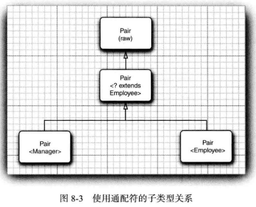
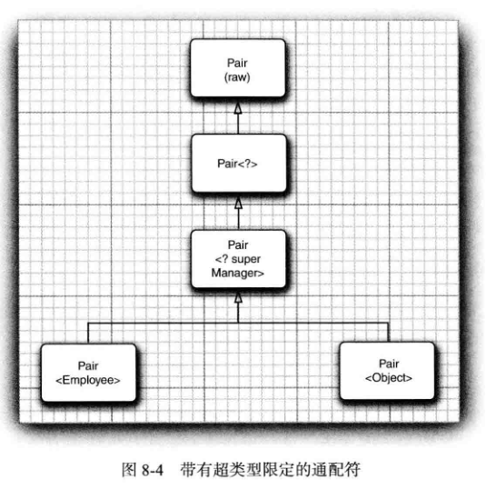

<div align=center><h1>8.8 通配符类型</h1></div>

#### `<T extends Comparable<? super T>>`
```java
? extends Employee getFirst()
void setFirst(? extends Employee)
```


### 8.8.1 通配符概念

* 1、通配符类型中，允许类型参数变化。例如，通配符类型
  ```java
  Pair<? extends Employee>
  ```
	* 表示任何泛型 Pair 类型，它的类型参数是 Employee 的子类，如 `Pair<Manager>`，但不是`Pair<String>`。
	* 假设要编写一个打印雇员对的方法，像这样：
	  ```java
	  public static void printBuddies(Pair<Employee> p) {
           Employee first = p.getFirst();
           Employee second = p.getSecond();
           Systefn.out.println(first.getName() + " and " + second.getName() + " are buddies.");
	  }
	  ````
	* 正如前面讲到的，不能将 Pair<Manager>传递给这个方法，这一点很受限制。解决的方法很简单：**使用通配符类型**：
	  ```java
	  public static void printBuddies(Pair<? extends Eiployee> p)
	  ```
* 2、类型 `Pair<Manager>`是 `Pair<? extends Employee>`的子类型（如图 8-3所示）。

   <div align="center"></div>

* 3、使用通配符会通过 `Pair<? extends Employee>`的引用破坏 `Pair<Manager>`吗？
  ```java
  Pair<Manager> managerBuddies = new Pair(ceo, cfo);
  Pair<? extends Employee> wildcardBuddies = managerBuddies; // OK
  wildcardBuddies.setFirst(lowlyEmployee); // compile-time error
  ```
	* 这可能不会引起破坏。对 setFirst 的调用有一个类型错误。要了解其中的缘由，请仔细看一看类型 `Pair<? extendsE mployee〉`。其方法似乎是这样的：
	  ```java
	  ? extends Employee getFirst()
	  void setFirst(? extends Employee)
	  ```
	* 这样将**不可能调用 setFirst方法**。编译器只知道需要某个 Employee的子类型，但不知道具体是什么类型。它拒绝传递任何特定的类型。毕竟？不能用来匹配。
	* **使用 getFirst 就不存在这个问题**：将 getFirst的返回值赋给一个 Employee的引用完全合法。
	* 这就是引人有限定的通配符的关键之处。现在已经有办法区分**安全的访问器方法**和**不安全的更改器方法**了。

### 8.8.2 通配符的超类型限定

* 1、通配符限定与类型变量限定十分类似，但是，还有一个附加的能力，即可以指定一个超类型限定（supertype bound), 如下所亦：
  ```java
  ? super Manager
  ```
	* **这个通配符限制为Manager 的所有超类型**。（已有的 super关键字十分准确地描述了这种联系，这一点令人感到非常欣慰。）
* 2、为什么要这样做呢？ 带有超类型限定的通配符的行为与 8.8.1节介绍的相反。**可以为方法提供参数，但不能使用返回值**。例如，`Pair<? super Manager>`有方法:
  ```java
  void setFirst(? super Manager)
  ? super Manager getFirst()
  ```
	* 这不是真正的 Java语法，但是可以看出编译器知道什么。
	* 编译器无法知道 setFirst方法的具体类型，因此调用这个方法时不能接受类型为Employee或Object 的参数。**只能传递Manager 类型的对象，或者某个子类型（如 Executive) 对象**。
	* 另外，如果调用getFirst，**不能保证返回对象的类型**。只能把它赋给一个 Object。

   <div align="center"></div>

* 3、**带有超类型限定的通配符可以向泛型对象写人，带有子类型限定的通配符可以从泛型对象读取**。
* 4、子类型限定的另一个常见的用法是作为一个函数式接口的参数类型。例如,Collection 接口有一个方法：
  ```java
  default boolean reniovelf(Predicate<? super E> filter)
  ```
	* 这个方法会删除所有满足给定谓词条件的元素。例如，如果你不喜欢有奇怪散列码的员工，就可以如下将他们删除：
	  ```
	  ArrayList<Employee> staff = ...;
	  Predicate<Object> oddHashCode = obj->obj.hashCode() % 2 != 0;
	  staff.removelf(oddHashCode);
	  ```
	* 你希望传入一个 `Predicate<Object>`，而不只是`Predicate<Employee>`。Super通配符可以使这个愿望成真。

### 8.8.3 无限定通配符

* 1、还可以使用**无限定的通配符**，例如，Pair<?>。初看起来，这好像与原始的Pair 类型一样。实际上，有很大的不同。类型 Pair<?>有以下方法：
  ```java
  ? getFirst()
  void setFirt()
  ```
	* getFirst 的返回值只能赋给一个 Object。
	* setFirst 方法不能被调用，甚至不能用 Object 调用。
	* `Pair<?>`和 Pair 本质的不同在于：可以用任意 Object 对象调用原始 Pair 类的 setObject方法。
* 2、为什么要使用这样脆弱的类型？ **它对于许多简单的操作非常有用**。例如，下面这个方法将用来测试一个 pair 是否包含一个 null 引用，它不需要实际的类型。
  ```java
  public static boolean hasNulls(Pair<?> p) {
      return (p.getFirst() == null) || (p.getSecond() == null);
  }
  ```
	* 通过将 hasNulls 转换成泛型方法，可以避免使用通配符类型：
	  ```java
	  public static <T> boolean hasNulls(Pair<T> p)
	  ```
	* 但是，带有通配符的版本可读性更强。

### 8.8.4 通配符捕获

* 1、编写一个交换成对元素的方法：
  ```java
  public static void swap(Pair<?> p)
  ```
	* 通配符不是类型变量，因此，不能在编写代码中使用“？”作为一种类型。也就是说，下述代码是非法的：
	  ```java
	  ? t = p.getFirst();// Error
	  p.setFirst(p.getSecond());
	  p.setSecond(t);
	  ```
	* 这是一个问题，因为在交换的时候必须临时保存第一个元素。幸运的是，这个问题有一个有趣的解决方案。我们可以写一个辅助方法 swapHelper，如下所示：
	  ```java
	  public static <T> void swapHelper(Pair<T> p) {
           T t = p.getFirst();
           p.setFirst(p.getSecond());
           p.setSecond(t);
	  }
	  ```
	* 注意，swapHelper 是一个泛型方法，而 swap不是，它具有固定的 Pair<?>类型的参数。现在可以由 swap调用 swapHelper:
	  ```java
	  public static void swap(Pair<?> p) { swapHelper(p); }
	  ```
	* 在这种情况下，swapHelper方法的参数 T 捕获通配符。它不知道是哪种类型的通配符，但是，这是一个明确的类型，并且<T>swapHelper 的定义只有在 T指出类型时才有明确的含义。
	* 当然，在这种情况下，并不是一定要使用通配符。我们已经直接实现了没有通配符的泛型方法 `<T> void swap(Pair<T> p)`。

* 2、下面看一个通配符类型出现在计算中间的示例： 
  ```java
  public static void maxminBonus(Manager[] a, Pair<? super Manager> result) {
      minmaxBonus(a, result);
      PairAlg.swap(result); // OK——swapHel per captures wildcard type
  }
  ```
	* 在这里，通配符捕获机制是不可避免的。
* 3、通配符捕获只有在有许多限制的情况下才是合法的。
* 4、编译器必须能够确信通配符表达的是单个、确定的类型。
* 5、例如，`ArrayList<Pair<T>>`中的 T 永远不能捕获 `ArrayList<Pair<?>>`中的通配符。数组列表可以保存两个 `Pair<?>`，分别针对？的不同类型。


