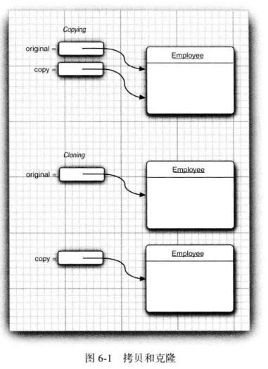
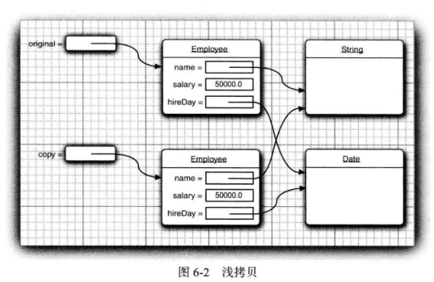

<div align=center><h1>6.2 接口示例</h1></div>

### 6.2.1 接口与回调

* 1、回调（callback) 是一种常见的程序设计模式。在这种模式中，可以指出某个特定事件发生时应该采取的动作。
* 2、对象可以携带一些附加的信息，所以传递一个对象比传递一个函数要灵活得多。

```java
package com.edu.test.interfacetest;

import javax.swing.*;
import java.awt.*;
import java.awt.event.ActionEvent;
import java.awt.event.ActionListener;
import java.util.Date;

/**
 * @Author: 王仁洪
 * @Date: 2019/3/18 21:32
 */
public class TimerTest {
    public static void main(String[] args) {
        ActionListener listener = new TimePrinter();

        //construct a timer that calls the listener
        //once every 10 seconds
        Timer timer = new Timer(10000,listener);
        timer.start();

        JOptionPane.showMessageDialog(null,"Quit program?");
        System.exit(0);
    }
}

class TimePrinter implements ActionListener{

    @Override
    public void actionPerformed(ActionEvent e) {
        System.out.println("At the tone, the time is " + new Date());
        Toolkit.getDefaultToolkit().beep();
    }
}
```

### 6.2.2 Comparator 接口

### 6.2.3 对象克隆

* 1、拷贝和克隆
	* 要了解克隆的具体含义，先来回忆为一个包含对象引用的变量建立副本时会发生什么。原变量和副本都是同一个对象的引用（见图 6-1)。这说明，任何一个变量改变都会影响另一个变量。
	  ```java
	  Employee original = new Employee("John Public", 50000);
	  Employee copy = original;
	  copy.raiseSalary(lO); //oops-also changed original
	  ```
	* 如果希望 copy是一个新对象，它的初始状态与 original 相同，但是之后它们各自会有自己不同的状态，这种情况下就可以使用 clone方法。
	  ```java
	  Employee copy = original,clone();
	  copy.raiseSalary(lO);// OK original unchanged
	  ```

	<div align="center"></div>

* 2、图 6-2显示了使用Object 类的 clone 方法克隆这样一个 Employee 对象会发生什么。可以看到，默认的克隆操作是“浅拷贝”，并没有克隆对象中引用的其他对象。

	<div align="center"></div>

	* 不过，通常子对象都是可变的，必须重新定义 clone 方法来建立一个深拷贝，同时克隆所有子对象。

* 3、**浅拷贝**会有什么影响吗？ 这要看具体情况。如果原对象和浅克隆对象共享的子对象是不可变的，那么这种共享就是安全的。如果子对象属于一个不可变的类，如 String, 就 是 这 种情况。或者在对象的生命期中，子对象一直包含不变的常量，没有更改器方法会改变它，也没有方法会生成它的引用，这种情况下同样是安全的。
* 4、对于每一个类，需要确定：
	* 1)默认的 clone 方法是否满足要求；
	* 2)是否可以在可变的子对象上调用 clone 来修补默认的 clone 方法；
	* 3)是否不该使用 clone。
* 5、实际上第 3 个选项是默认选项。如果选择第 1 项或第 2项，类必须：
	* 1)实现 Cloneable 接口；
	* 2)重新定义 clone 方法，并指定 public 访问修饰符。
* 6、Object 类中 clone 方法声明为 protected, 所以你的代码不能直接调用 anObject.clone()。但是，不是所有子类都能访问受保护方法吗？ 不是所有类都是 Object 的子类吗？ 幸运的是，受保护访问的规则比较微妙。子类只能调用受保护的clone方法来克隆它自己的对象。必须重新定义 clone 为 public 才能允许所有方法克隆对象。


