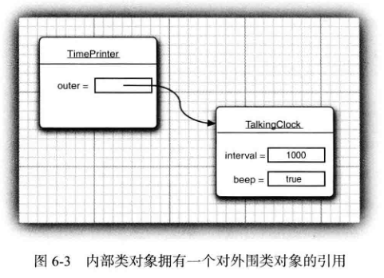
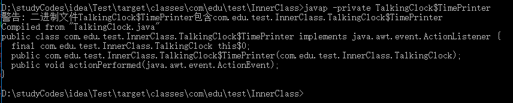
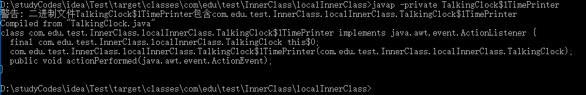
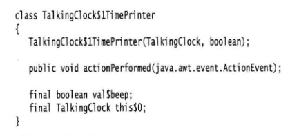

<div align=center><h1>6.4 内部类</h1></div>

* 1、内部类（ inner class) 是定义在另一个类中的类。为什么需要使用内部类呢？ 其主要原因有以下三点：
	* 内部类方法可以访问该类定义所在的作用域中的数据，包括私有的数据。
	* 内部类可以对同一个包中的其他类隐藏起来。
	* 当想要定义一个回调函数且不想编写大量代码时，使用匿名 （anonymous) 内部类比较便捷。
* 2、Link 类位于 LinkedList 类的私有部分，因此，Link 对其他的代码均不可见。鉴于此情况，可以将 Link 的数据域设计为公有的，它仍然是安全的。这些数据域只能被LinkedList 类（具有访问这些数据域的合理需要）中的方法访问，而不会暴露给其他的代码。**在 Java中，只有内部类能够实现这样的控制**。
* 3、Java内部类还有另外一个功能，这使得它比 C++的嵌套类更加丰富，用途更加广泛。内部类的对象有一个隐式引用，它引用了实例化该内部对象的外围类对象。通过这个指针，可以访问外围类对象的全部状态。
* 4、在 Java中，static 内部类没有这种附加指针，这样的内部类与 C++ 中的嵌套类很相似。


### 6.4.1 使用内部类访问对象状态

```java
//成员内部类
package com.edu.test.InnerClass;

import javax.swing.*;
import java.awt.*;
import java.awt.event.ActionEvent;
import java.awt.event.ActionListener;
import java.util.Date;

/**
 * @Author: 王仁洪
 * @Date: 2019/3/20 21:17
 * A clock that prints the time in regular intervals.
 */
public class TalkingClock {
    private int interval;
    private boolean beep;

    /**
     * Constructs a talking clock
     * @param interval the interval between messages (in milliseconds)
     * @param beep true if the clock should beep
     */
    public TalkingClock(int interval,boolean beep){
        this.interval = interval;
        this.beep = beep;
    }

    /**
     * Starts the clock.
     */
    public void start(){
        ActionListener listener = new TimePrinter();
        Timer timer = new Timer(interval,listener);
        timer.start();
    }

    public class TimePrinter implements ActionListener{

        @Override
        public void actionPerformed(ActionEvent event) {
            System.out.println("At the tone, the time is " + new Date());
            if (beep){
                Toolkit.getDefaultToolkit().beep();
            }
        }
    }
}

class  InnerClassTest{
    public static void main(String[] args) {
        TalkingClock clock = new TalkingClock(1000,true);
        clock.start();

        //keep program running until user selects "0k"
        JOptionPane.showMessageDialog(null,"Quit program?");
        System.exit(0);
    }
}
```

* 1、需要注意，这里的 TimePrinter类位于 TalkingClock类内部。这并不意味着每个TalkingClock都有一个 TimePrinter实例域。
* 2、TimePrinter类没有实例域或者名为 beep的变量，取而代之的是beep引用了创建 TimePrinter 的 TalkingClock 对象的域。
* 3、内部类既可以访问自身的数据域，也可以访问创建它的外围类对象的数据域。
* 4、内部类的对象总有一个隐式引用，它指向了创建它的外部类对象。如图 6-3所示。

  <div align="center"></div>
	* 这个引用在内部类的定义中是不可见的。然而，为了说明这个概念，我们将外围类对象的引用称为 outer。于是 actionPerformed方法将等价于下列形式：
	  ```java
	  public void actionPerformed(ActionEvent event){
	       System.out.printlnC'At the tone, the time is " + new Date());
	       if (owter.beep) 
	           Toolkit.getDefaultToolkit().beep();
	  }
	  ```
	* 外围类的引用在构造器中设置。编译器修改了所有的内部类的构造器，添加一个外围类引用的参数。因为 TimePrinter类没有定义构造器，所以编译器为这个类生成了一个默认的构造器，其代码如下所示：
	  ```java
	  public TimePrinter(TalkingGock clock){//automatically generated code
	       outer = clock;
	  }
	  ```
	* **outer 不是 Java的关键字。我们只是用它说明内部类中的机制**。
	* 当在 start方法中创建了 TimePrinter 对象后，编译器就会将 this引用传递给当前的语音时钟的构造器：
	  ```java
	  ActionListener listener = new TimePrinter(this); // parameter automatically added
	  ```
* 5、TimePrinter 类声明为私有的。这样一来，只有 TalkingClock 的方法才能够构造TimePrinter 对象。
* 6、只有内部类可以是私有类，而常规类只可以具有包可见性，或公有可见性。
* 7、**成员内部类的创建**：
  ```java
  TalkingClock.TimePrinter timePrinter = new TalkingClock().new TimePrinter();
  timePrinter.actionPerformed(null);
  ```


### 6.4.2 内部类的特殊语法规则

* 1、内部类有一个外围类的引用 outer。事实上，使用外围类引用的正规语法还要复杂一些。
* 2、表达式`OuterClass.this`表示外围类引用。例如，可以像下面这样编写 TimePrinter 内部类的 actionPerformed方法：
  ```java
  public void actionPerformed(ActionEvent event){
      if (TalkingClock.this,beep) 
          Toolkit.getDefaultToolkitO.beep();
  }
  ```
	* 反过来，可以采用下列语法格式更加明确地编写内部对象的构造器：
	  ```java
	  outerObject.n&H InnerClass{construction parameters)
	  ```
	* 例如:
	  ```java
	  ActionListener listener = this.newTimePrinter();
	  ```
* 3、需要注意，在外围类的作用域之外，可以这样引用内部类：
  ```java
  OuterClass.InnerClass
  ```
* 4、**内部类中声明的所有静态域都必须是 final**。原因很简单。我们希望一个静态域只有一个实例，不过对于每个外部对象，会分别有一个单独的内部类实例。如果这个域不是 final, 它可能就不是唯一的。
* 5、**内部类不能有 static方法**。Java语言规范对这个限制没有做任何解释。也可以允许有静态方法，但只能访问外围类的静态域和方法。显然，Java设计者认为相对于这种复杂性来说，它带来的好处有些得不偿失。

### 6.4.3 内部类是否有用、必要和安全

* 1、当在 Java 1.1 的 Java语言中增加内部类时，很多程序员都认为这是一项很主要的新特性，但这却违背了 Java要比 C++更加简单的设计理念。内部类的语法很复杂。
* 2、由于增加了一些看似优美有趣，实属没必要的特性，似乎 Java也开始走上了许多语言饱受折磨的毁灭性道路上。
* 3、**内部类是一种编译器现象，与虚拟机无关**。编译器将会把内部类翻译成用 `$` (美元符号）分隔外部类名与内部类名的常规类文件，而虚拟机则对此一无所知。
* 4、例如，在 TalkingClock类内部的 TimePrinter类将被翻译成类文件 `TalkingClock$TimePrinter.class`。 
* 5、为了能够看到执行的效果，可以做一下这个实验：运行`javap`命令,并将类`TalkingClock$TimePrinter`传递给它进行反射。
  ```java
  javap -private TalkingClock$TimePrinter
  ```
  
  <div align="center"></div>

	* 可以清楚地看到，编译器为了引用外围类，生成了一个附加的实例域 this$0 (名字this$0是由编译器合成的，在自己编写的代码中不能够引用它）。另外，还可以看到构造器的TalkingClock 参数。
* 6、**内部类可以访问外围类的私有数据**，但除了内部类外的其他类则不行。可见，由于内部类拥有访问特权，所以与常规类比较起来功能更加强大。
* 7、总而言之，如果内部类访问了私有数据域，就有可能通过附加在外围类所在包中的其他类访问们，但做这些事情需要高超的技巧和极大的决心。程序员不可能无意之中就获得对类的访问权限，而必须刻意地构建或修改类文件才有可能达到这个目的。

### 6.4.4 局部内部类

```java
package com.edu.test.InnerClass.localInnerClass;

import javax.swing.*;
import java.awt.*;
import java.awt.event.ActionEvent;
import java.awt.event.ActionListener;
import java.util.Date;

/**
 * @Author: 王仁洪
 * @Date: 2019/3/21 9:02
 */
public class TalkingClock {
    private int interval;
    private boolean beep;

    /**
     * Constructs a talking clock
     * @param interval the interval between messages (in milliseconds)
     * @param beep true if the clock should beep
     */
    public TalkingClock(int interval,boolean beep){
        this.interval = interval;
        this.beep = beep;
    }

    /**
     * Starts the clock.
     */
    public void start(){
        class TimePrinter implements ActionListener{

            @Override
            public void actionPerformed(ActionEvent event) {
                System.out.println("At the tone, the time is " + new Date());
                if (beep){
                    Toolkit.getDefaultToolkit().beep();
                }
            }
        }
        ActionListener listener = new TimePrinter();
        Timer timer = new Timer(interval,listener);
        timer.start();
    }
}
class  InnerClassTest{
    public static void main(String[] args) {
        TalkingClock clock = new TalkingClock(1000,true);
        clock.start();

        //keep program running until user selects "0k"
        JOptionPane.showMessageDialog(null,"Quit program?");
        System.exit(0);
    }
}
```

* 1、如果仔细地阅读一下 TalkingClock 示例的代码就会发现，TimePrinter 这个类名字只在start 方法中创建这个类型的对象时使用了一次。当遇到这类情况时，可以在一个方法中定义**局部类**。
  ```java
  public void start(){
        class TimePrinter implements ActionListener{

            @Override
            public void actionPerformed(ActionEvent event) {
                System.out.println("At the tone, the time is " + new Date());
                if (beep){
                    Toolkit.getDefaultToolkit().beep();
                }
            }
        }
        ActionListener listener = new TimePrinter();
        Timer timer = new Timer(interval,listener);
        timer.start();
  }
  ```
* 2、局部类不能用 public或 private访问说明符进行声明。它的作用域被限定在声明这个局部类的块中。
* 3、局部类有一个优势，即对外部世界可以完全地隐藏起来。即使 TalkingClock类中的其他代码也不能访问它。除 start 方法之外，没有任何方法知道 TimePrinter 类的存在。

### 6.4.5 由外部方法访问变量

* 1、与其他内部类相比较，局部类还有一个优点。它们不仅能够访问包含它们的外部类，还可以访问局部变量。不过，那些**局部变量必须事实上为 final**。这说明，它们一旦赋值就绝不会改变。
* 2、在 start 方法内部，为什么不能访问 beep变量的值呢？为了能够清楚地看到内部的问题，让我们仔细地考査一下控制流程。
	* 1)调用 start方法。
	* 2)调用内部类 TimePrinter 的构造器，以便初始化对象变量 listener。
	* 3)将 listener 引用传递给 Timer 构造器，定时器开始计时，start方法结束。此时，start方法的 beep参数变量不复存在。
	* 4)然后，actionPerformed方法执行 if(beep)...。
* 3、为了能够让 actionPerformed方法工作，**TimePrinter类在 beep域释放之前将 beep域用start方法的局部变量进行备份**。实际上也是这样做的。在我们列举的例子中，编译器为局部内部类构造了名字 TalkingClock$1TimePrinter。如果运行javap命令,并将类TalkingClock$1TimePrinter传递给它进行反射，就会看到下列结果：

  <div align="center"></div>

  <div align="center"></div>

	* 请注意构造器的 boolean参数和 val$beep实例变量。当创建一个对象的时候，beep就会被传递给构造器，并存储在 val$beep域中。编译器必须检测对局部变量的访问，为每一个变量建立相应的数据域，并将局部变量拷贝到构造器中，以便将这些数据域初始化为局部变量的副本。
* 4、**局部类的方法只可以引用定义为 final 的局部变量**。鉴于此情况，在列举的示例中，将 beep参数声明为 final, 对它进行初始化后不能够再进行修改。因此，就使得局部变量与在局部类内建立的拷贝保持一致。

### 6.4.6 匿名内部类

```java
package com.edu.test.InnerClass.anonymousInnerClass;

import javax.swing.*;
import java.awt.*;
import java.awt.event.ActionEvent;
import java.awt.event.ActionListener;
import java.util.Date;

/**
 * @Author: 王仁洪
 * @Date: 2019/3/21 9:55
 */
public class TalkingClock {
    /**
     * Starts the clock.
     * @param interval the interval between messages (in milliseconds)
     * @param beep true if the clock should beep
     */
    public void start(int interval,boolean beep){
        ActionListener listener = new ActionListener() {
            @Override
            public void actionPerformed(ActionEvent e) {
                System.out.println("At the tone, the time is " + new Date());
                if (beep){
                    Toolkit.getDefaultToolkit().beep();
                }
            }
        };
        Timer timer = new Timer(interval,listener);
        timer.start();
    }
}
class  InnerClassTest{
    public static void main(String[] args) {
        TalkingClock clock = new TalkingClock();
        clock.start(1000,true);

        //keep program running until user selects "0k"
        JOptionPane.showMessageDialog(null,"Quit program?");
        System.exit(0);
    }
}
```

* 1、将局部内部类的使用再深人一步。假如只创建这个类的一个对象，就不必命名了。这种类被称为**匿名内部类（anonymousinner class)**。
  ```java
  public void start(int interval,boolean beep){
        ActionListener listener = new ActionListener() {
            @Override
            public void actionPerformed(ActionEvent e) {
                System.out.println("At the tone, the time is " + new Date());
                if (beep){
                    Toolkit.getDefaultToolkit().beep();
                }
            }
        };
        Timer timer = new Timer(interval,listener);
        timer.start();
  }
  ```
* 2、这种语法确实有些难以理解。它的含义是：创建一个实现 ActionListener 接口的类的新对象，需要实现的方法 actionPerformed定义在括号内。通常的语法格式为：
  ```java
  new SuperType(constructionparameters){
      inner class methods and data
  }
  ```
	* 其中，SuperType可以是 ActionListener 这样的接口，于是内部类就要实现这个接口。SuperType也可以是一个类，于是内部类就要扩展它。
* 3、由于构造器的名字必须与类名相同，而匿名类没有类名，所以，**匿名类不能有构造器**。取而代之的是，将构造器参数传递给超类（superclass) 构造器。尤其是在内部类实现接口的时候，不能有任何构造参数。不仅如此，还要像下面这样提供一组括号：
  ```
  new InterfaceType(){
     methods and data
  }
  ```
* 4、看看构造一个类的新对象与构造一个扩展了那个类的匿名内部类的对象之间有什么差别。
  ```
  Person queen = new Person("Mary");
  //a Person object
  Person count = new Person("Dracula") { 
      . . .
  };
  // an object of an inner class extending Person
  ```
* 5、如果构造参数的闭小括号后面跟一个开大括号，正在定义的就是匿名内部类。
* 6、使用匿名内部类的解决方案比较简短、更切实际、更易于理解。
* 7、Java程序员习惯的做法是用匿名内部类实现事件监听器和其他回调。如今**最好还是使用 lambda表达式**。
* 8、start 方法用 lambda表达式来写会简洁得多，如下所示：
  ```java
  public void start(int interval,boolean beep){
        Timer timer = new Timer(interval,event ->{
            System.out.println("At the tone, the time is " + new Date());
            if (beep){
                Toolkit.getDefaultToolkit().beep();
            }
        });
        timer.start();
  }
  ```
* 9、下面的技巧称为“双括号初始化”（double brace initialization), 这里利用了内部类语法。假设你想构造一个数组列表，并将它传递到一个方法：
  ```java
  ArrayList<String> friends = new ArrayListo()；
  friends,add("Harry")；
  friends,add("Tony");
  invite(friends);
  ```
	* 如果不再需要这个数组列表，最好让它作为一个匿名列表。不过作为一个匿名列表，该如何为它添加元素呢？ 方法如下：
	  ```java
	  invite(new ArrayList<String>(){
	      { add("Harry"); add("Tony"); }
	  });
	  ```
	* 注意这里的双括号。外层括号建立了 ArrayList 的一个匿名子类。内层括号则是一个对象构造块
* 10、建立一个与超类大体类似（但不完全相同）的匿名子类通常会很方便。不过，对于 equals方法要特别当心。我们曾建议 equals方法最好使用以下测试：
  ```java
  if (getClass() != other.getClass()) return false;
  ```
	* 但是对匿名子类做这个测试时会失败。
* 11、生成曰志或调试消息时，通常希望包含当前类的类名，如：
  ```java
  System.err.println("Something awful happened in " + getClass())；
  ```
	* 不过，这对于静态方法不奏效。毕竟，调用 getClass时调用的是 this.getClass(), 而静态方法没有 this。所以应该使用以下表达式：
	  ```java
	  new Object(){}.getCIass().getEndosingClass() // gets class of static method
	  ```
		* 在这里，newObject(){} 会建立 Object的一个匿名子类的一个匿名对象，getEnclosingClass则得到其外围类，也就是包含这个静态方法的类。


### 6.4.7 静态内部类

```java
package com.edu.test.InnerClass.staticInnerClass;

/**
 * @Author: 王仁洪
 * @Date: 2019/3/21 10:41
 */
public class ArrayAIg {
    /**
     * A pair of floating-point numbers
     */
    public static class Pair{
        private double first;
        private double second;

        /**
         *  Constructs a pair from two floating-point numbers
         * @param f the fi rst number
         * @param s the second number
         */
        public Pair(double f,double s){
            first = f;
            second = s;
        }

        /**
         * Returns the fi rst number of the pair
         * @return the first number
         */
        public double getFirst() {
            return first;
        }

        /**
         * Returns the second number of the pair
         * @return the second number
         */
        public double getSecond() {
            return second;
        }
    }

    /**
     * Computes both the minimum and the maximum of an array
     * @param values an array of floating-point numbers
     * @return a pair whose fi rst element is the minimum and whose second element
     * is the maximum
     */
    public static Pair mininax(double[] values){
        double min = Double.POSITIVE_INFINITY;
        double max = Double.POSITIVE_INFINITY;

        for (double val : values){
            if (min > val)
                min = val;
            if (max < val)
                max = val;
        }
        return new Pair(min,max);
    }
}

class StaticInnerClassTest{
    public static void main(String[] args) {
        double[] values = new double[20];
        for (int i = 0; i < values.length; i++) {
            values[i] = 100 * Math.random();
        }
        ArrayAIg.Pair pair = ArrayAIg.mininax(values);
        System.out.println("min=" + pair.getFirst());
        System.out.println("max=" + pair.getSecond());
    }
}
```

* 1、有时候，使用内部类只是为了把一个类隐藏在另外一个类的内部，并**不需要内部类引用外围类对象**。为此，可以将内部类声明为 static, 以便取消产生的引用。
* 2、**只有内部类可以声明为 static**。静态内部类的对象除了没有对生成它的外围类对象的引用特权外，与其他所冇内部类完全一样。
* 3、在内部类不需要访问外围类对象的时候，应该使用静态内部类。有些程序员用嵌套类 （nested class) 表示静态内部类。
* 4、与常规内部类不同，**静态内部类可以有静态域和方法**。
* 5、**声明在接口中的内部类自动成为 static 和 public类**。


