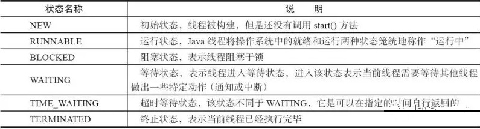
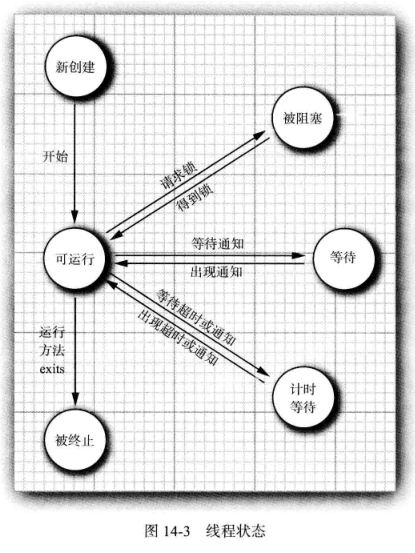

<h1>14.3 线程状态</h1>

* 线程可以有如下 6种状态：

### 14.3.1 新创建线程
* 1、当用 new操作符创建一个新线程时，如 newThread(r)，该线程还没有开始运行。这意味着它的状态是 new。
* 2、当一个线程处于**新创建状态**时，程序还没有开始运行线程中的代码。
* 3、在线程运行之前还有一些基础工作要做。

### 14.3.2 可运行线程
* 1、一旦调用 start方法，线程处于 **runnable 状态**。一个可运行的线桿**可能正在运行也可能没有运行**，这取决于操作系统给线程提供运行的时间。
	* Java的规范说明没有将它作为一个单独状态。一个正在运行中的线程仍然处于可运行状态。
* 2、一旦一个线程开始运行，它不必始终保持运行。
	* 事实上，**运行中的线程被中断，目的是为了让其他线程获得运行机会**。
	* 线程调度的细节依赖于操作系统提供的服务。
	* 抢占式调度系统给每一个可运行线程一个时间片来执行任务。当时间片用完，操作系统剥夺该线程的运行权，并给另一个线程运行机会（见图 14-4)。当选择下一个线程时，操作系统考虑线程的优先级。
  

* 3、现在所有的桌面以及服务器操作系统都使用抢占式调度。
* 4、但是，像手机这样的小型设备可能使用协作式调度。在这样的设备中，一个线程只有在**调用 yield方法、或者被阻塞或等待时，线程才失去控制权**。
* 5、在具有多个处理器的机器上，每一个处理器运行一个线程，可以有多个线程**并行运行**。当然，如果线程的数目多于处理器的数目，调度器依然采用时间片机制。
* 6、记住，在任何给定时刻，二个可运行的线程可能正在运行也可能没有运行（这就是为什么将这个状态称为可运行而不是运行)。

### 14.3.3 被阻塞线程和等待线程
* 1、当线程处于被阻塞或等待状态时，它暂时不活动。它不运行任何代码且消耗最少的资源。直到线程调度器重新激活它。细节取决于它是怎样达到非活动状态的。
* 2、**当一个线程试图获取一个内部的对象锁（而不是javiutiUoncurrent 库中的锁)，而该锁被其他线程持有，则该线程进人阻塞状态**（我们在 14.5.3节讨论java.util.concurrent锁，在 14.5.5节讨论内部对象锁)。**当所有其他线程释放该锁，并且线程调度器允许本线程持有它的时候，该线程将变成非阻塞状态**。
* 3、**当线程等待另一个线程通知调度器一个条件时，它自己进入等待状态**。我们在第14.5.4节来讨论条件。在调用 Object.wait 方法或 Thread.join方法，或者是等待 java,util.concurrent 库中的 Lock 或 Condition 时，就会出现这种情况。实际上，**被阻塞状态与等待状态是有很大不同的**。
* 4、有几个方法有一个**超时参数**。调用它们导致线程进人**计时等待（timed waiting) 状态**。这一状态将一直保持到超时期满或者接收到适当的通知。**带有超时参数的方法有Thread.sleep 和 Object.wait、Thread.join、Lock.tryLock 以及 Condition.await 的计时版**。
* 5、图 14-3展示了线程可以具有的状态以及从一个状态到另一个状态可能的转换。
	* 当一个线程被阻塞或等待时（或终止时)，另一个线程被调度为运行状态。
	* 当一个线程被重新激活（例如，因为超时期满或成功地获得了一个锁)，调度器检查它是否具有比当前运行线程更高的优先级。如果是这样，调度器从当前运行线程中挑选一个，剥夺其运行权，选择一个新的线程运行。

### 14.3.4 被终止的线程
* 1、线程因如下两个原因之一而被终止：
	* 因为 run 方法正常退出而自然死亡。
	* 因为一个没有捕获的异常终止了 nm方法而意外死亡。
* 2、特别是，可以调用线程的 stop方法杀死一个线程。该方法抛出 ThreadDeath错误对象,由此杀死线程。但是，**stop方法已过时，不要在自己的代码中调用这个方法**。

