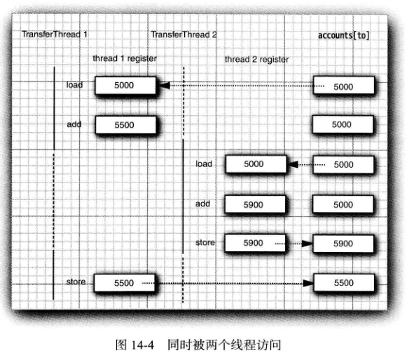

<div align="center"><h1>14.5 同步</h1></div>

### 14.5.1 竞争条件的一个例子
* 1、为了避免多线程引起的对共享数据的说误，必须学习如何**同步存取**。

### 14.5.2 竞争条件详解

* 1、假定两个线程同时执行指令
  ```java
  accounts[to] += amount;
  ```
	* 问题在于这不是原子操作。该指令可能被处理如下：
		* 1)将 accounts[to] 加载到寄存器。
		* 2)增 加 amount。
		* 3)将结果写回 accounts[to]。
	* 现在，假定第 1 个线程执行步骤 1 和 2, 然后，它被剥夺了运行权。假定第 2个线程被唤醒并修改了 accounts 数组中的同一项。然后，第 1个线程被唤醒并完成其第 3步。
	* 这样，这一动作擦去了第二个线程所做的更新。于是，总金额不再正确。（见图 14-4J

  <div align="center"></div>
* 2、真正的问题是 transfer方法的执行过程中可能会被中断。
* 3、**如果能够确保线程在失去控制之前方法运行完成**，那么银行账户对象的状态永远不会出现讹误。

### 14.5.3 锁对象

* 1、有两种机制**防止代码块受并发访问的干扰**。
	* Java语言提供一个 synchronized关键字达到这一目的，
	* 并且 Java SE 5.0引入了 ReentrantLock类
* 2、synchronized关键字自动提供一个锁以及相关的“ 条件”，对于大多数需要显式锁的情况，这是很便利的。
* 3、用 ReentrantLock 保护代码块的基本结构如下：
  ```java
  private Lock myLock = new ReentrantLock();// ReentrantLock implements the Lock interface
  myLock.lock();//a ReentrantLock object
  try {
      critical section
  } finally {
      myLock.unlock();// make sure the lock is unlocked even if an exception is thrown
  }
  ```
	* 这一结构确保任何时刻只有一个线程进人临界区。
	* 一旦一个线程封锁了锁对象，其他任何线程都无法通过 lock语句。
	* 当其他线程调用 lock时，它们被阻塞，直到第一个线程释放锁对象。
	* 把**解锁操作**括在 finally子句之内是至关重要的。如果在临界区的代码抛出异常，锁必须被释放。否则，其他线程将永远阻塞。
* 4、**锁是可重入的，因为线程可以重复地获得已经持有的锁**。
* 5、锁保持一个持有计数（hold count) 来跟踪对 lock 方法的嵌套调用。**线程在每一次调用 lock 都要调用 unlock 来释放锁**。由于这一特性，被一个锁保护的代码可以调用另一个使用相同的锁的方法。
* 6、要留心临界区中的代码，不要因为异常的抛出而跳出临界区。如果在临界区代码结束之前抛出了异常，finally 子句将释放锁，但会使对象可能处于一种受损状态。
* 7、构建一个带有公平策略的锁。一个公平锁偏爱等待时间最长的线程。但是，这一公平的保证将大大降低性能。所以，默认情况下，锁没有被强制为公平的。
  ```java
  ReentrantLock(boo1ean fair)
  ```
	* 听起来公平锁更合理一些，但是使用公平锁比使用常规锁要慢很多。
	* 只有当你确实了解自己要做什么并且对于你要解决的问题有一个特定的理由必须使用公平锁的时候，才可以使用公平锁。
	* 即使使用公平锁，也无法确保线程调度器是公平的。
	* 如果线程调度器选择忽略一个线程，而该线程为了这个锁已经等待了很长时间，那么就没有机会公平地处理这个锁了。

### 14.5.4 条件对象

* 1、通常，线程进人临界区，却发现在某一条件满足之后它才能执行。
* 2、要使用一个条件对象来管理那些已经获得了一个锁但是却不能做有用工作的线程。
* 3、由于历史的原因，**条件对象经常被称为条件变量（conditional variable)**。

```java
程序清单 14-7 com/edu/test/multithreading/SynchBankTest.java

package com.edu.test.multithreading;

import java.util.Arrays;
import java.util.concurrent.locks.Condition;
import java.util.concurrent.locks.Lock;
import java.util.concurrent.locks.ReentrantLock;

/**
 * @Author: 王仁洪
 * @Date: 2019/4/1 17:51
 */
public class SynchBankTest {
    public static final int NACCOUNTS = 100;
    public static final double INITIAL_BALANCE = 1000;
    public static final double MAX_AMOUNT = 1000;
    public static final int DELAY = 10;

    public static void main(String[] args) {
        Bank bank = new Bank(NACCOUNTS,INITIAL_BALANCE);
        for (int i=0;i<NACCOUNTS;i++){
            int fromAccount = i;
            Runnable r = ()->{
                try {
                    while (true){
                        int toAccount = (int) (bank.size() * Math.random());
                        double amount = MAX_AMOUNT * Math.random();
                        bank.transfer(fromAccount, toAccount, amount);
                        Thread.sleep((int) (DELAY * Math.random()));
                    }
                }catch (InterruptedException e){
                    e.printStackTrace();
                }
            };
            Thread thread =  new Thread(r);
            thread.start();
        }
    }
}
class Bank{
    private final double[] accounts;
    private Lock bankLock;
    private Condition sufficientFunds;

    /**
     * Constructs the bank.
     * @param n the number of accounts
     * @param initialBalance the initial balance for each account
     */
    public Bank(int n,double initialBalance){
        accounts = new double[n];
        Arrays.fill(accounts,initialBalance);
        bankLock = new ReentrantLock();
        sufficientFunds = bankLock.newCondition();
    }

    /**
     * Transfers money from one account to another.
     * @param from the account to transfer from
     * @param to the account to transfer to
     * @param amount the amount to transfer
     */
    public void transfer(int from,int to,double amount) throws InterruptedException {
        bankLock.lock();
        try {
            while (accounts[from] < amount) {
                sufficientFunds.await();
            }
            System.out.print(Thread.currentThread());
            accounts[from] -= amount;
            System.out.printf("%10.2f from %d to %d",amount,from,to);
            accounts[to] += amount;
            System.out.printf("Total Balance: %10.2f %n",getTotalBalance());
            sufficientFunds.signalAll();
        }finally {
            bankLock.unlock();
        }
    }

    /**
     * Gets the sum of all account balances.
     * @return the total balance
     */
    public double getTotalBalance(){
        bankLock.lock();
        try {
            double sum = 0;
            for (double a : accounts){
                sum += a;
            }
            return sum;
        }finally {
            bankLock.unlock();
        }
    }

    /**
     * Gets the number of accounts in the bank.
     * @return the number of accounts
     */
    public int size(){
        return accounts.length;
    }
}
```

### 14.5.5 synchronized 关键字

* 1、有关锁和条件的关键之处：
	* 锁用来保护代码片段，任何时刻只能有一个线程执行被保护的代码。
	* 锁可以管理试图进入被保护代码段的线程。
	* 锁可以拥有一个或多个相关的条件对象。
	* 每个**条件对象**管理那些已经进入被保护的代码段但还不能运行的线程。
* 2、Lock 和 Condition接口为程序设计人员提供了高度的锁定控制。
* 3、如果一个方法用 synchronized关键字声明，那么对象的锁将保护整个方法。也就是说，要调用该方法，线程必须获得内部的对象锁。
  ```java
  换句话说，
  public synchronized void method(){
      method body
  }
  等价于：
  public void method(){
      this.intrinsidock.lock();
      try {
          method body
      }
      finally { 
          this.intrinsicLock.unlock(); 
      }
  }
  ```
* 4、内部对象锁只有一个相关条件。**wait方法添加一个线程到等待集中**，**notifyAll /notify方法解除等待线程的阻塞状态**。换句话说，调用 wait 或 notityAll 等价于
  ```java
  intrinsicCondition.await();
  intrinsicCondition.signalAll();
  ```
* 5、wait、notifyAll以及notify方法是Object 类的 final 方法。Condition方法必须被命名为 await、signalAll 和signal 以便它们不会与那些方法发生冲突。
* 6、由锁来管理那些试图进入 synchronized 方法的线程，由条件来管理那些调用 wait 的线程。
* 7、将静态方法声明为synchronized也是合法的。如果调用这种方法，该方法获得相关的**类对象的内部锁**。
	* 例如，如果 Bank 类有一个静态同步的方法，那么当该方法被调用时，`Bank.class`对象的锁被锁住。
	* 因此，没有其他线程可以调用同一个类的这个或任何其他的同步静态方法。
* 8、内部锁和条件存在一些局限。包括：
	* 不能中断一个正在试图获得锁的线程。
	* 试图获得锁时不能设定超时。
	* 每个锁仅有单一的条件，可能是不够的。
* 9、在代码中应该使用哪一种？ Lock 和 Condition 对象还是同步方法？下面是一些建议：
	* 最好既不使用 Lock/Condition 也不使用 synchronized 关键字。在许多情况下你可以使用java.util.concurrent 包中的一种机制，它会为你处理所有的加锁。例如，在 14.6节，你会看到如何使用阻塞队列来同步完成一个共同任务的线程。还应当研究一下并行流，有关内容参见卷II第 1 章。
	* 如果 synchronized 关键字适合你的程序，那么请尽量使用它，这样可以减少编写的代码数量，减少出错的几率。程序清单 14-8给出了用同步方法实现的银行实例。
	* 如果特别需要 Lock/Condition结构提供的独有特性时，才使用 Lock/Condition。

### 14.5.6 同步阻塞
* 1、每一个 Java 对象有一个锁。**线程可以通过调用同步方法获得锁**。
* 2、还有另一种机制可以获得锁，通过进入一个同步阻塞。当线程进入如下形式的阻塞：
  ```java
  synchronized (obj){// this is the syntax for a synchronized block
      critical section
  }
  ```
	* 于是它获得 Obj 的锁。
* 3、Vector类的 get 和 set方法是同步的。
* 4、**Vector类对自己的所有可修改方法都使用内部锁**。然而，这是真的吗？ Vector 类的文档没有给出这样的承诺。不得不仔细研究源代码并希望将来的版本能介绍非同步的可修改方法。
* 5、客户端锁定是非常脆弱的，通常不推荐使用。

### 14.5.7 监视器概念

* 1、锁和条件是线程同步的强大工具，但是，严格地讲，它们不是面向对象的。
* 2、**监视器（monitor)**, 这一概念最早是由 PerBrinchHansen和 TonyHoare在 20世纪 70年代提出的。用 Java的术语来讲，监视器具有如下特性：
	* 监视器是只包含私有域的类。
	* 每个监视器类的对象有一个相关的锁。
	* 使用该锁对所有的方法进行加锁。
		* 换句话说，如果客户端调用 obj.meth0d(), 那 么 obj对象的锁是在方法调用开始时自动获得，并且当方法返回时自动释放该锁。因为所有的域是私有的，这样的安排可以确保一个线程在对对象操作时，没有其他线程能访问该域。
	* 该锁可以有任意多个相关条件。
* 3、研究表明盲目地重新测试条件是低效的。显式的条件变量解决了这一问题。**每一个条件变量管理一个独立的线程集**。
* 4、Java 中的每一个对象有一个内部的锁和内部的条件。如果一个方法用 synchronized 关键字声明，那么，它表现的就像是一个监视器方法。通过调用 wait/notifyAll/notify 来访问条件变量。
* 5、在下述的 3 个方面 Java 对象不同于监视器，从而使得线程的安全性下降：
	* 域不要求必须是 private。
	* 方法不要求必须是 synchronized。
	* 内部锁对客户是可用的。

### 14.5.8 Volatile 域

* 1、有时，仅仅为了读写一个或两个实例域就使用同步，显得开销过大了。毕竟，什么地方能出错呢？ 遗憾的是，使用现代的处理器与编译器，出错的可能性很大。
* 2、多处理器的计算机能够暂时在**寄存器**或**本地内存缓冲区**中保存内存中的值。结果是，**运行在不同处理器上的线程可能在同一个内存位置取到不同的值**。
* 3、编译器可以改变指令执行的顺序以使吞吐量最大化。这种顺序上的变化不会改变代码语义，但是编译器假定内存的值仅仅在代码中有显式的修改指令时才会改变。然而，**内存的值可以被另一个线程改变**！
* 4、如果向一个变量写入值，而这个变量接下来可能会被另一个线程读取，或者，从一个变量读值，而这个变量可能是之前被另一个线程写入的，此时必须使用同步。
* 5、**volatile关键字**为实例域的同步访问提供了一种免锁机制。如果声明一个域为 volatile,那么**编译器和虚拟机就知道该域是可能被另一个线程并发更新的**。
* 6、**Volatile 变量不能提供原子性**。
* 7、不能确保翻转域中的值。不能保证读取、翻转和写入不被中断。

### 14.5.9 final 变置

* 1、上一节已经了解到，除非使用锁或 volatile修饰符，否则无法从多个线程安全地读取一个域。
* 2、还有一种情况可以安全地访问一个共享域，即这个域声明为 final 时。考虑以下声明：
  ```java
  final Map<String, Double> accounts = new HashMap<>();
  ```
	* 其他线程会在构造函数完成构造之后才看到这个 accounts变量。
* 3、如果不使用 final，就不能保证其他线程看到的是 accounts更新后的值，它们可能都只是看到 null, 而不是新构造的 HashMap。
* 4、当然，对这个映射表的操作并不是线程安全的。如果多个线程在读写这个映射表，仍然需要进行同步。

### 14.5.10 原子性

* 1、假设对共享变量除了赋值之外并不完成其他操作，那么可以将这些共享变量声明为 volatile。
* 2、类 Atomiclnteger、AtomicIntegerArray、AtomicIntegerFieldUpdater、AtomicLongArray、AtomicLongFieldUpdater、AtomicReference、AtomicReferenceArray 和 AtomicReferenceFieldUpdater也提供了这些方法。
* 3、如果有大量线程要访问相同的原子值，性能会大幅下降，因为乐观更新需要太多次重试。
	* Java SE 8提供了 LongAdder 和 LongAccumulator 类来解决这个问题。
	* LongAdder 包括多个变量（加数)，其总和为当前值。
	* 可以有多个线程更新不同的加数，线程个数增加时会自动提供新的加数。
	* 通常情况下，只有当所有工作都完成之后才需要总和的值，对于这种情况，这种方法会很高效。性能会有显著的提升。

### 14.5.11 死锁

* 1、有可能会因为每一个线程要等待更多的钱款存人而导致所有线程都被阻塞。这样的状态称为**死锁（deadlock)**。
* 2、遗憾的是，Java 编程语言中没有任何东西可以避免或打破这种死锁现象。必须仔细设计程序，以确保不会出现死锁。遗憾的是，Java 编程语言中没有任何东西可以避免或打破这种死锁现象。必须仔细设计程序，以确保不会出现死锁。

### 14.5.12 线程局部变量
* 1、时可能要避免共享变量，使用ThreadLocal 辅助类为各个线程提供各自的实例。
* 2、例如，**SimpleDateFormat类不是线程安全的**。假设有一个静态变量：
  ```java
  public static final SimpleDateFormat dateFormat = new SimpleDateFormat("yyyy-MM-dd");
  如果两个线程都执行以下操作：
  String dateStamp = dateFormat.format(new Date());
  ```
	* 结果可能很混乱，因为 dateFormat 使用的内部数据结构可能会被并发的访问所破坏。
	* 当然可以使用同步，但开销很大；或者也可以在需要时构造一个局部 SimpleDateFormat 对象，不过这也太浪费了。
* 3、要为每个线程构造一个实例，可以使用以下代码：
  ```java
  public static final ThreadLocal<SimpleDateFormat> dateFormat =
        ThreadLocal.withInitial(() ->new SimpleDateFormat("yyyy-MM-dd"));
  要访问具体的格式化方法，可以调用：
  String dateStamp = dateFormat.get().format(new Date());
  ```
	* 在一个给定线程中首次调用 get 时，会调用 initialValue方法。在此之后，get方法会返回属于当前线程的那个实例。
* 4、在多个线程中生成随机数也存在类似的问题。**java.util.Rand0m类是线程安全的**。但是如果多个线程需要等待一个共享的随机数生成器，这会很低效。
* 5、可以使用 ThreadLocal 辅助类为各个线程提供一个单独的生成器，不过 Java SE 7还另外提供了一个便利类。只需要做以下调用：
  ```java
  int random = ThreadLocalRandom.current().nextInt(upperBound);
  ```
	* ThreadLocalRandom.current()调用会返回特定于当前线程的 Random 类实例。


### 14.5.13 锁测试与超时
* 1、**lock 方法不能被中断**。如果一个线程在等待获得一个锁时被中断，中断线程在获得锁之前一直处于阻塞状态。如果出现死锁，那么，lock 方法就无法终止。
* 2、如果一个线程被另一个线程通过调用 signalAU 或 signal 激活，或者超时时限已达到，或者线程被中断，那么 await方法将返回。
* 3、如果等待的线程被中断，await 方法将抛出一个 InterruptedException异常。在你希望出现这种情况时线程继续等待（可能不太合理)，可以使用awaitUninterruptibly方法代替 await。

### 14.5.14 读/写锁

* 1、java.util.concurrent.locks 包定义了两个锁类，我们已经讨论的 ReentrantLock 类和 ReentrantReadWriteLock 类。
* 2、如果很**多线程从一个数据结构读取数据**而很**少线程修改**其中数据的话，ReentrantReadWriteLock 类是十分有用的。
	* 在这种情况下，允许对读者线程共享访问是合适的。
* 3、下面是使用读/写锁的必要步骤：
	* 1)构造一个 ReentrantReadWriteLock 对象：
	  ```java
	  private ReentrantReadWriteLock rwl = new ReentrantReadWriteLock();
	  ```
	* 2)抽取读锁和写锁：
	  ```java
	  private Lock readLock = rwl.readLock();
	  private Lock writeLock = rwl.writeLock();
	  ```
	* 3)对所有的获取方法加读锁：
	  ```java
	  public double getTotalBalance(){
    	  readLock.lock();
    	  try { 
        	  ......
    	  } finally { 
        	  readLock.unlock(); 
    	  }
	  }
	  ```
	* 4)对所有的修改方法加写锁：
	  ```java
	  public void transfer(. . .) {
    	  writeLock.lock();
    	  try { 
        	  ......
    	  } finally { 
        	  writeLock.unlock();
    	  }
	  }
	  ```

### 14.5.15 为什么弃用 stop 和 suspend 方法
* 1、初始的 Java版本定义了一个 stop方法用来终止一个线程，以及一个 suspend方法用来阻塞一个线程直至另一个线程调用 resume。stop和suspend方法有一些共同点：都试图控制一个给定线程的行为。
* 2、stop、suspend和 resume方法已经弃用。stop方法天生就不安全，经验证明 suspend方法会经常导致死锁。
* 3、 **stop方法**，该方法终止所有未结束的方法，包括 run方法。当线程被终止，立即释放被它锁住的所有对象的锁。这会导致对象处于不一致的状态。
* 4、当线程要终止另一个线程时，无法知道什么时候调用 stop方法是安全的，什么时候导致对象被破坏。因此，该方法被弃用了。
	* **在希望停止线程的时候应该中断线程，被中断的线程会在安全的时候停止**。
* 5、一些作者声称 stop方法被弃用是因为它会导致对象被一个已停止的线程永久锁定。但是，**这一说法是错误的**。从技术上讲，被停止的线程通过抛出 ThreadDeath异常退出所有它所调用的同步方法。结果是，该线程释放它持有的内部对象锁。
* 6、与 stop不同，suspend不会破坏对象。
* 7、如果用 suspend挂起一个持有一个锁的线程，那么，该锁在恢复之前是不可用的。
* 8、如果调用suspend方法的线程试图获得同一个锁，那么程序死锁：被挂起的线程等着被恢复，而将其挂起的线程等待获得锁。


