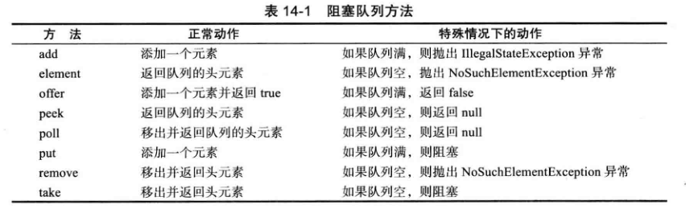

<h1>14.6 阻塞队列</h1>

* 1、对于许多线程问题，可以通过使用一个或多个队列以优雅且安全的方式将其形式化。
* 2、生产者线程向队列插人元素，消费者线程则取出它们。使用队列，可以安全地从一个线程向另一个线程传递数据。
* 3、当试图向队列添加元素而队列已满，或是想从队列移出元素而队列为空的时候，阻塞队列（blocking queue) 导致**线程阻塞**。
	* 在协调多个线程之间的合作时，阻塞队列是一个有用的工具。
	* 工作者线程可以周期性地将中间结果存储在阻塞队列中。
	* 其他的工作者线程移出中间结果并进一步加以修改。
	* 队列会自动地平衡负载。
	* 如果第一个线程集运行得比第二个慢，第二个线程集在等待结果时会阻塞。
	* 如果第一个线程集运行得快，它将等待第二个队列集赶上来。
* 4、表 14-1给出了阻塞队列的方法。
  

* 5、阻塞队列方法分为以下 3类:（这取决于当队列满或空时它们的响应方式。）
	* 如果将队列当作线程管理工具来使用，将要用到 put 和 take方法。
	* 当试图向**满的队列中添加**或从**空的队列中移出**元素时，add、remove和 element 操作抛出异常。
	* 当然，在一个多线程程序中，队列会在任何时候空或满，因此，一定要使用 offer、poll 和 peek方法作为替代。
	* 这些方法如果不能完成任务，只是给出一个错误提示而不会抛出异常。
* 6、poll 和 peek 方法返回空来指示失败。因此，向这些队列中插入 null 值是非法的。
* 7、**如果队列满，则 put方法阻塞**；**如果队列空，则 take方法阻塞**。在不带超时参数时，offer 和 poll 方法等效。
* 8、java.util.concurrent 包提供了阻塞队列的几个变种。
	* 默认情况下，LinkedBlockingQueue的容量是没有上边界的，但是，也可以选择指定最大容量。
	* LinkedBlockingDeque是一个双端的版本。
	* ArrayBlockingQueue在构造时需要指定容量，并且有一个可选的参数来指定是否需要公平性。
		* 若设置了公平参数，则那么等待了最长时间的线程会优先得到处理。
		* 通常，公平性会降低性能，只有在确实非常需要时才使用它。
* 9、PriorityBlockingQueue是一个**带优先级的队列**，而不是先进先出队列。
	* 元素按照它们的优先级顺序被移出。
	* 该队列是没有容量上限，但是，如果队列是空的，取元素的操作会阻塞。

