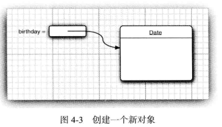
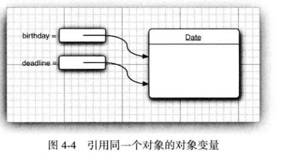

<div align=center><h1>4.2 使用预定义类</h1></div>

### 4.2.1 对象与对象变量

* 1、并不是所有的类都具有面向对象特征。例如，**Math类**。Math类只封装了功能，它不需要也不必隐藏数据。由于没有数据，因此也不必担心生成对象以及初始化实例域。
* 2、要想使用对象，就必须首先构造对象，并指定其初始状态。然后，对对象应用方法。
* 3、在 Java 程序设计语言中，使用构造器（constructor) 构造新实例。构造器是一种特殊的方法，用来构造并初始化对象。
* 4、构造器的名字应该与类名相同。因此 Date类的构造器名为 Date。要想构造一个 Date对象，需要在构造器前面加上 new操作符，如下所示：
  ```java
  new Date()
  ```
* 5、通常，希望构造的对象可以多次使用，因此，需要将对象存放在一个变量中：
  ```java
  Date birthday = new Date();
  ```
  <div align="center"></div>

* 6、在对象与对象变量之间存在着一个重要的区别。
	* 例如，语句：
	  ```java
	  Date deadline;// deadline doesn't refer to any object
	  ```
		* 定义了一个对象变量 deadline, 它可以引用 Date类型的对象。但是，一定要认识到：变量deadline不是一个对象，实际上也没有引用对象。此时，不能将任何 Date方法应用于这个变量上。语句
		  ```java
		  s = deadline.toString(); // not yet
		  将产生编译错误。
		  ```
	* 必须首先初始化变量 deadline, 这里有两个选择。
		* 可以用新构造的对象初始化这个变量：
		  ```java
		  deadline = new Date();
		  ```
		* 也让这个变量引用一个已存在的对象：
		  ```java
		  deadline = birthday;
		  ```
		* 现在，这两个变量引用同一个对象（请参见图 4-4)。
  		<div align="center"></div>
* 7、一定要认识到：**一个对象变量并没有实际包含一个对象，而仅仅引用一个对象。**
* 8、在 Java中，任何对象变量的值都是对存储在另外一个地方的一个对象的引用。new操作符的返回值也是一个引用。下列语句：`Date deadline = new Date();`有两个部分。表达式 `new Date()` 构造了一个 Date类型的对象，并且它的值是对新创建对象的引用。这个引用存储在变量 deadline中。
* 9、**局部变量不会自动地初始化为 null，而必须通过调用 new 或将它们设置为 null 进行初始化**。
* 10、很多人错误地认为 Java对象变量与 C++的引用类似。然而，在 C++中没有空引用，并且引用不能被赋值。可以将 Java的对象变量看作 C++的对象指针。例如，
  ```java
  Date birthday; // Java
  实际上，等同于
  Date* birthday; // C++
  一个 Date* 指针只能通过调用new进行初始化。就这一点而言，C++ 与 Java的语法几乎是一样的。
  ```
* 11、**所有的 Java对象都存储在堆中**。当一个对象包含另一个对象变量时，这个变量依然包含着指向另一个堆对象的指针。

### 4.2.2  Java 类库中的 LocalDate 类
* 1、时间是用距离一个固定时间点的毫秒数（可正可负）表示的，这个点就是所谓的纪元（epoch), 它是 UTC时间 `1970 年 1月 1 日 00:00:00`。UTC是 Coordinated Universal Time的缩写，与大家熟悉的 GMT(即 Greenwich Mean Time,格林威治时间）一样，是一种具有实践意义的科学标准时间。
* 2、类库设计者决定将保存时间 ` 与 ` 给时间点命名 分开。所以标准 Java类库分别包含了两个类：
	* 一个是用来表示时间点的 Date类；
	* 另一个是用来表示大家熟悉的日历表示法的 LocalDate类。
### 4.2.3 更改器方法与访问器方法
* 1、