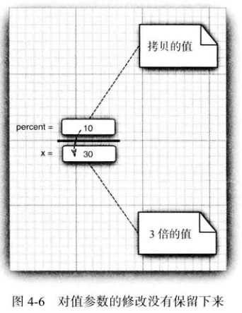
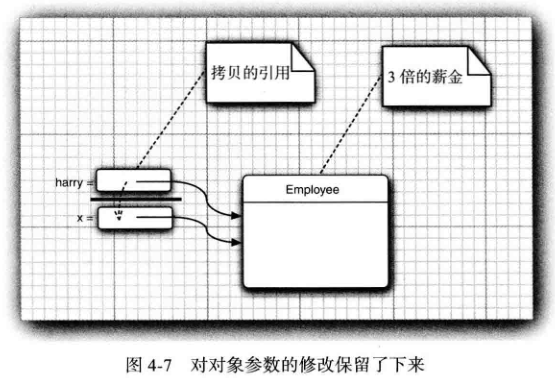
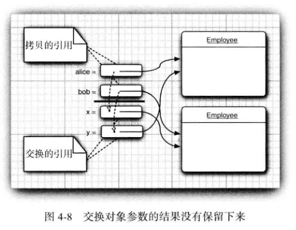

<div align=center><h1>4.5 方法参数</h1></div>

* 1、**按值调用** （call by value) 表示方法接收的是调用者提供的值。
* 2、**按引用调用** （call by reference)表示方法接收的是调用者提供的变量地址。
* 3、一个方法可以修改传递引用所对应的变量值，而不能修改传递值调用所对应的变量值。
* 4、Java程序设计语言总是采用**按值调用**。也就是说，方法得到的是所有参数值的一个拷贝，特别是，方法不能修改传递给它的任何参数变量的内容。
* 5、方法参数共有两种类型：
	* 基本数据类型（数字、布尔值)。
	* 对象引用。
* 6、**一个方法不可能修改一个基本数据类型的参数**。假定一个方法试图将一个参数值增加至 3倍：
  ```java
  public static void tripieValue(double x){// doesn't work
      x = 3*x;
  }

  然后调用这个方法：
  double percent = 10;
  tripieValue(percent);
  ```

	* 不过，并没有做到这一点调用这个方法之后，percent 的值还是 10。下面看一下具体的执行
程：
		* 1) x 被初始化为 percent 值的一个拷贝（也就是 10)。
		* 2) x 被乘以 3 后等于 30。但是 percent 仍然是 10(如图 4-6所示)。
		* 3) 这个方法结束之后，参数变量 X 不再使用。

  		<div align="center"></div>

* 7、对象引用作为参数，可以很容易地利用下面这个方法实现将一个雇员的薪金提高两倍的操作：
  ```java
  public static void tripieSalary(Employee x){// works
     x.raiseSa1ary(200);
  }
  然后调用这个方法:
  harry= new Employee(. . .);
  tripieSalary(harry);
  ```
	* 具体的执行过程为：
		* 1) X 被初始化为 harry 值的拷贝，这里是一个对象的引用。	
		* 2) raiseSalary 方法应用于这个对象引用。x 和 harry 同时引用的那个 Employee 对象的薪金提高了 200%。
		* 3) 方法结束后，参数变量 x 不再使用。当然，对象变量 harry 继续引用那个薪金增至 3倍的雇员对象（如图 4-7所示)。

  		<div align="center"></div>
	* **实现一个改变对象参数状态的方法并不是一件难事。理由很简单，方法得到的是对象引用的拷贝，对象引用及其他的拷贝同时引用同一个对象。**
* 8、Java 程序设计语言对对象采用的**不是引用调用**。首先，编写一个交换两个雇员对象的方法：
  ```java
  public static void swap(Employee x, Employee y){// doesn't work
     Employee temp = x;
     x = y;
     y = temp;
  }
  如果 Java 对对象采用的是按引用调用，那么这个方法就应该能够实现交换数据的效果：
  Employee a = new Employee("Alice", . . .);
  Employee b = new Employee("Bob", . . .);
  swap(a, b);
  //does a now refer to Bob, b to Alice?
  但是，方法并没有改变存储在变量 a 和 b 中的对象引用。swap方法的参数 x 和 y 被初始化为两个对象引用的拷贝，这个方法交换的是这两个拷贝。
  // x refers to Alice, y to Bob
  Employee temp = x;
  x = y;
  y = temp;
  //now x refers to Bob, y to Alice
  最终，白费力气。在方法结束时参数变量 X 和 y 被丢弃了。原来的变量 a 和 b 仍然引用这个方法调用之前所引用的对象（如图 4-8所示)。
  ```

  <div align="center"></div>

	* 这个过程说明：Java 程序设计语言对对象采用的不是引用调用，实际上，对象引用是按
值传递的。

* 9、Java中方法参数的使用情况：
	* 一个方法不能修改一个基本数据类型的参数（即数值型或布尔型）。
	* 一个方法可以改变一个对象参数的状态。
	* 一个方法不能让对象参数引用一个新的对象。